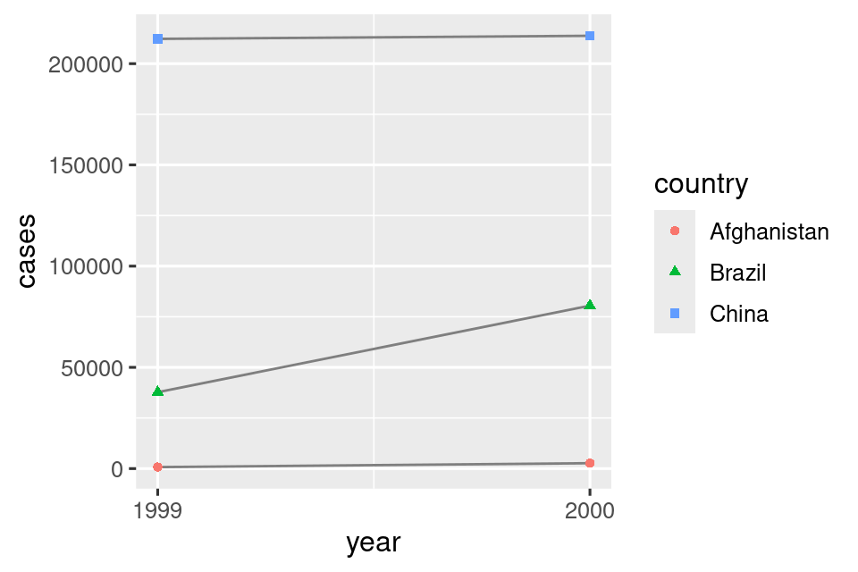
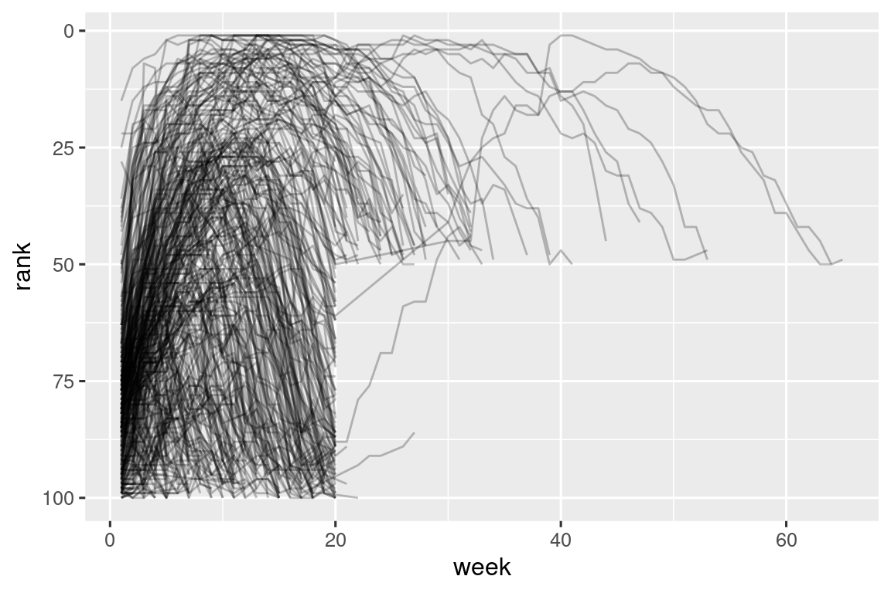
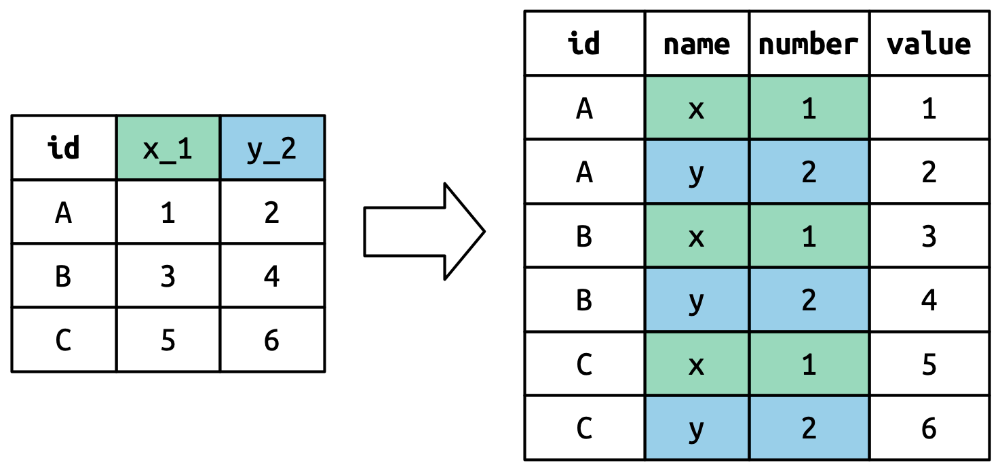

# 数据整理
## 介绍

> “幸福的家庭都是相似的；每个不幸的家庭都有各自的不幸。”
> — 列夫·托尔斯泰
> “整洁的数据集都是相似的，但每个混乱的数据集都有各自的混乱之处。” 
> — 哈德利·维克汉姆

在本章中，你将学习使用一种称为**整洁数据**的系统来组织你的数据的一致方式。将数据整理成这种格式需要一些前期工作，但这项工作会在长期内得到回报。一旦你有了整洁的数据和 tidyverse 包提供的整洁工具，你将花费更少的时间将数据从一种表示形式转换为另一种，从而可以更多地花在你关心的数据问题上。

在本章中，你将首先了解整洁数据的定义，并将其应用于一个简单的示例数据集。然后，我们将深入研究你用于整理数据的主要工具：数据透视。数据透视允许你在不改变任何值的情况下更改数据的形式。

### 先决条件

在本章中，我们将专注于 tidyr，这是一个提供了许多工具来帮助整理混乱数据集的包。tidyr 是核心 tidyverse 的成员。

```R
library(tidyverse)
```

从本章开始，我们将抑制来自 `library(tidyverse)` 的加载消息。

## 整洁数据

你可以用多种方式表示相同的底层数据。下面的示例展示了以三种不同方式组织的相同数据。每个数据集显示了四个变量的相同值：国家、年份、人口和结核病（TB）的文档化病例数，但每个数据集以不同的方式组织这些值。

```R
table1
#> # A tibble: 6 × 4
#>   country      year  cases population
#>   <chr>       <dbl>  <dbl>      <dbl>
#> 1 Afghanistan  1999    745   19987071
#> 2 Afghanistan  2000   2666   20595360
#> 3 Brazil       1999  37737  172006362
#> 4 Brazil       2000  80488  174504898
#> 5 China        1999 212258 1272915272
#> 6 China        2000 213766 1280428583

table2
#> # A tibble: 12 × 4
#>   country      year type           count
#>   <chr>       <dbl> <chr>          <dbl>
#> 1 Afghanistan  1999 cases            745
#> 2 Afghanistan  1999 population  19987071
#> 3 Afghanistan  2000 cases           2666
#> 4 Afghanistan  2000 population  20595360
#> 5 Brazil       1999 cases          37737
#> 6 Brazil       1999 population 172006362
#> # ℹ 6 more rows

table3
#> # A tibble: 6 × 3
#>   country      year rate             
#>   <chr>       <dbl> <chr>            
#> 1 Afghanistan  1999 745/19987071     
#> 2 Afghanistan  2000 2666/20595360    
#> 3 Brazil       1999 37737/172006362  
#> 4 Brazil       2000 80488/174504898  
#> 5 China        1999 212258/1272915272
#> 6 China        2000 213766/1280428583
```

这些都是相同底层数据的表示，但它们的使用方式并不相同。其中一个，table1，将在 tidyverse 中更容易处理，因为它是**整洁**的。

有三条相互关联的规则定义了整洁数据集：

1. 每个变量是一列；每列是一个变量。
2. 每个观察值是一行；每行是一个观察值。
3. 每个值是一个单元格；每个单元格是一个单一值。

[图一](#fig1)以可视化方式展示了这些规则。

<figure id="fig1">
  
  <figcaption>图一：以下三条规则使数据集变得整洁：变量是列，观察是行，值是单元格。</figcaption>
</figure>


确保数据整洁有两个主要优势：

1. 选择一种一致的数据存储方式具有普遍优势。如果你有一个一致的数据结构，学习处理数据的工具会更容易，因为它们具有基本的统一性。

2. 将变量放在列中具有特定的优势，因为它能够充分发挥 R 的向量化特性。正如你在第 3.3.1 节和第 3.5.2 节中学到的，大多数内置的 R 函数都可以处理值向量。这使得转换整洁数据感觉特别自然。

dplyr、ggplot2 和 tidyverse 中的所有其他包都被设计用于处理整洁数据。以下是一些小例子，展示了如何处理 table1。

```R
# Compute rate per 10,000
table1 |>
  mutate(rate = cases / population * 10000)
#> # A tibble: 6 × 5
#>   country      year  cases population  rate
#>   <chr>       <dbl>  <dbl>      <dbl> <dbl>
#> 1 Afghanistan  1999    745   19987071 0.373
#> 2 Afghanistan  2000   2666   20595360 1.29 
#> 3 Brazil       1999  37737  172006362 2.19 
#> 4 Brazil       2000  80488  174504898 4.61 
#> 5 China        1999 212258 1272915272 1.67 
#> 6 China        2000 213766 1280428583 1.67

# Compute total cases per year
table1 |> 
  group_by(year) |> 
  summarize(total_cases = sum(cases))
#> # A tibble: 2 × 2
#>    year total_cases
#>   <dbl>       <dbl>
#> 1  1999      250740
#> 2  2000      296920

# Visualize changes over time
ggplot(table1, aes(x = year, y = cases)) +
  geom_line(aes(group = country), color = "grey50") +
  geom_point(aes(color = country, shape = country)) +
  scale_x_continuous(breaks = c(1999, 2000)) # x-axis breaks at 1999 and 2000
```

<figure id="fig2">
  
</figure>

### 练习

1. 对于每个示例表格，描述每个观察和每列代表的内容。

2. 为了计算 table2 和 table3 的比率，你需要执行四个操作：

  a. 提取每个国家每年的结核病例数。
  b. 提取每个国家每年的人口匹配数据。
  c. 将病例数除以人口，然后乘以 10000。
  d. 存储回适当的位置。

尽管你还没有学会所有需要实际执行这些操作的函数，但你应该能够想出你需要的转换过程。

## 数据拉长

整洁数据的原则可能看起来如此明显，以至于你会想知道是否会遇到一个不整洁的数据集。然而，不幸的是，大多数真实数据都是不整洁的。主要有两个原因：

1. 数据通常是组织起来以促进除了分析之外的某个目标。例如，通常将数据结构化以便于进行数据输入，而不是分析。

2. 大多数人不熟悉整洁数据的原则，除非你花了很多时间处理数据，否则很难自己推导出这些原则。

这意味着大多数真实的分析都需要进行一些整理。你将首先找出潜在的变量和观察对象。有时这很容易；其他时候，你需要与最初生成数据的人进行咨询。接下来，你将把数据**转换**为整洁形式，其中变量在列中，观察在行中。

tidyr 提供了两个函数来转换数据：pivot_longer() 和 pivot_wider()。我们首先从 pivot_longer() 开始，因为它是最常见的情况。让我们深入一些示例。

### 数据列名

billboard 数据集记录了 2000 年歌曲的公告牌排名：

```R
billboard
#> # A tibble: 317 × 79
#>   artist       track               date.entered   wk1   wk2   wk3   wk4   wk5
#>   <chr>        <chr>               <date>       <dbl> <dbl> <dbl> <dbl> <dbl>
#> 1 2 Pac        Baby Don't Cry (Ke… 2000-02-26      87    82    72    77    87
#> 2 2Ge+her      The Hardest Part O… 2000-09-02      91    87    92    NA    NA
#> 3 3 Doors Down Kryptonite          2000-04-08      81    70    68    67    66
#> 4 3 Doors Down Loser               2000-10-21      76    76    72    69    67
#> 5 504 Boyz     Wobble Wobble       2000-04-15      57    34    25    17    17
#> 6 98^0         Give Me Just One N… 2000-08-19      51    39    34    26    26
#> # ℹ 311 more rows
#> # ℹ 71 more variables: wk6 <dbl>, wk7 <dbl>, wk8 <dbl>, wk9 <dbl>, …
```

在这个数据集中，每个观察是一首歌曲。前三列（artist、track 和 date.entered）是描述歌曲的变量。然后我们有 76 列（wk1-wk76），描述了歌曲在每周的排名。在这里，列名是一个变量（周），单元格的值是另一个变量（排名）。

为了整理这个数据，我们将使用 pivot_longer()：

```R
billboard |> 
  pivot_longer(
    cols = starts_with("wk"), 
    names_to = "week", 
    values_to = "rank"
  )
#> # A tibble: 24,092 × 5
#>    artist track                   date.entered week   rank
#>    <chr>  <chr>                   <date>       <chr> <dbl>
#>  1 2 Pac  Baby Don't Cry (Keep... 2000-02-26   wk1      87
#>  2 2 Pac  Baby Don't Cry (Keep... 2000-02-26   wk2      82
#>  3 2 Pac  Baby Don't Cry (Keep... 2000-02-26   wk3      72
#>  4 2 Pac  Baby Don't Cry (Keep... 2000-02-26   wk4      77
#>  5 2 Pac  Baby Don't Cry (Keep... 2000-02-26   wk5      87
#>  6 2 Pac  Baby Don't Cry (Keep... 2000-02-26   wk6      94
#>  7 2 Pac  Baby Don't Cry (Keep... 2000-02-26   wk7      99
#>  8 2 Pac  Baby Don't Cry (Keep... 2000-02-26   wk8      NA
#>  9 2 Pac  Baby Don't Cry (Keep... 2000-02-26   wk9      NA
#> 10 2 Pac  Baby Don't Cry (Keep... 2000-02-26   wk10     NA
#> # ℹ 24,082 more rows
```

在这个数据后面，有三个关键参数：

- cols 指定需要进行转换的列，即哪些列不是变量。这个参数使用与 select() 相同的语法，所以这里我们可以使用 !c(artist, track, date.entered) 或 starts_with("wk")。
- names_to 给列名命名，我们命名为 week。
- values_to 给单元格值命名，我们命名为 rank。

请注意，在代码中，“week” 和 “rank” 都被引用起来，因为这些是我们正在创建的新变量，在运行 pivot_longer() 调用时，它们在数据中还不存在。

现在让我们将注意力转向结果更长的数据框。如果一首歌曲在前 100 名的时间少于 76 周会发生什么？以 2 Pac 的 “Baby Don't Cry” 为例。上面的输出表明它只在前 100 名中停留了 7 周，所有剩余的周都用缺失值填充。这些 NA 实际上并不代表未知的观察结果；它们是由数据集的结构所迫使存在的，所以我们可以要求 pivot_longer() 通过设置 values_drop_na = TRUE 来摆脱它们：

```R
billboard |> 
  pivot_longer(
    cols = starts_with("wk"), 
    names_to = "week", 
    values_to = "rank",
    values_drop_na = TRUE
  )
#> # A tibble: 5,307 × 5
#>   artist track                   date.entered week   rank
#>   <chr>  <chr>                   <date>       <chr> <dbl>
#> 1 2 Pac  Baby Don't Cry (Keep... 2000-02-26   wk1      87
#> 2 2 Pac  Baby Don't Cry (Keep... 2000-02-26   wk2      82
#> 3 2 Pac  Baby Don't Cry (Keep... 2000-02-26   wk3      72
#> 4 2 Pac  Baby Don't Cry (Keep... 2000-02-26   wk4      77
#> 5 2 Pac  Baby Don't Cry (Keep... 2000-02-26   wk5      87
#> 6 2 Pac  Baby Don't Cry (Keep... 2000-02-26   wk6      94
#> # ℹ 5,301 more rows
```

现在，行数要少得多，这表明许多带有 NA 的行已被删除。

你可能还想知道如果一首歌曲在前 100 名停留的时间超过 76 周会发生什么？我们无法从这个数据中得知，但你可能会猜测数据集会添加额外的列 wk77、wk78，以此类推。

现在，这个数据已经整理好了，但我们可以通过使用 mutate() 和 readr::parse_number() 将 week 的值从字符转换为数字，以使未来的计算变得更加容易。parse_number() 是一个方便的函数，它将从字符串中提取第一个数字，忽略所有其他文本。

```R
billboard_longer <- billboard |> 
  pivot_longer(
    cols = starts_with("wk"), 
    names_to = "week", 
    values_to = "rank",
    values_drop_na = TRUE
  ) |> 
  mutate(
    week = parse_number(week)
  )
billboard_longer
#> # A tibble: 5,307 × 5
#>   artist track                   date.entered  week  rank
#>   <chr>  <chr>                   <date>       <dbl> <dbl>
#> 1 2 Pac  Baby Don't Cry (Keep... 2000-02-26       1    87
#> 2 2 Pac  Baby Don't Cry (Keep... 2000-02-26       2    82
#> 3 2 Pac  Baby Don't Cry (Keep... 2000-02-26       3    72
#> 4 2 Pac  Baby Don't Cry (Keep... 2000-02-26       4    77
#> 5 2 Pac  Baby Don't Cry (Keep... 2000-02-26       5    87
#> 6 2 Pac  Baby Don't Cry (Keep... 2000-02-26       6    94
#> # ℹ 5,301 more rows
```

现在，我们将所有周数放在一个变量中，将所有排名值放在另一个变量中，这样我们就可以很容易地可视化歌曲排名随时间的变化。下面是代码，结果显示在[图二](#fig3) 中。我们可以看到很少有歌曲能在前 100 名中停留超过 20 周。

```R
billboard_longer |> 
  ggplot(aes(x = week, y = rank, group = track)) + 
  geom_line(alpha = 0.25) + 
  scale_y_reverse()
```

<figure id="fig3">
  
  <figcaption>图二：一条线图显示了歌曲排名随时间的变化。</figcaption>
</figure>

### 数据透视是如何实现的？

现在你已经看到我们如何使用数据透视来重塑数据，让我们花点时间来理解数据透视对数据的影响。我们从一个非常简单的数据集开始，以便更容易地理解正在发生的事情。假设我们有三个患者，分别是 A、B 和 C，我们对每个患者进行了两次血压测量。我们将使用 tribble() 创建数据，这是一个方便的手动构建小数据表的函数：

```R
df <- tribble(
  ~id,  ~bp1, ~bp2,
   "A",  100,  120,
   "B",  140,  115,
   "C",  120,  125
)
```

我们希望我们的新数据集有三个变量：id（已经存在）、measurement（列名）和value（单元格的值）。为了实现这一点，我们需要将 df 转换为更长的形式：

```R
df |> 
  pivot_longer(
    cols = bp1:bp2,
    names_to = "measurement",
    values_to = "value"
  )
#> # A tibble: 6 × 3
#>   id    measurement value
#>   <chr> <chr>       <dbl>
#> 1 A     bp1           100
#> 2 A     bp2           120
#> 3 B     bp1           140
#> 4 B     bp2           115
#> 5 C     bp1           120
#> 6 C     bp2           125
```

数据重塑的工作原理是什么？如果我们逐列思考，会更容易理解。如[图三](#fig4)所示，原始数据集中已经是变量的列（例如 id）中的值需要根据需要重复，以适应数据的新结构。

<figure id="fig4">
  
  <figcaption>图三：已经是变量的列需要根据需要重复，每个需要透视的列都要重复一次。</figcaption>
</figure>

列名成为新变量中的值，其名称由names_to定义，如[图四](#fig5)所示。它们需要根据原始数据集中的每一行重复一次。

<figure id="fig5">
  
  <figcaption>图四：对于被转置的列，列名变成了新列中的值。这些值需要在原始数据集的每一行中重复一次。</figcaption>
</figure>

单元格的值也成为了新变量中的值，其名称由values_to定义。它们逐行展开。图5.5说明了这个过程。

<figure id="fig6">
  
  <figcaption>图五：值的数量保持不变（不会重复），而是逐行展开。</figcaption>
</figure>

### 列中存在多个变量

更具挑战性的情况是当列名中塞入了多个信息，并且你希望将它们存储在单独的新变量中。例如，考虑上面你看到的 who2 数据集，它是 table1 等数据的来源：

```R
who2
#> # A tibble: 7,240 × 58
#>   country      year sp_m_014 sp_m_1524 sp_m_2534 sp_m_3544 sp_m_4554
#>   <chr>       <dbl>    <dbl>     <dbl>     <dbl>     <dbl>     <dbl>
#> 1 Afghanistan  1980       NA        NA        NA        NA        NA
#> 2 Afghanistan  1981       NA        NA        NA        NA        NA
#> 3 Afghanistan  1982       NA        NA        NA        NA        NA
#> 4 Afghanistan  1983       NA        NA        NA        NA        NA
#> 5 Afghanistan  1984       NA        NA        NA        NA        NA
#> 6 Afghanistan  1985       NA        NA        NA        NA        NA
#> # ℹ 7,234 more rows
#> # ℹ 51 more variables: sp_m_5564 <dbl>, sp_m_65 <dbl>, sp_f_014 <dbl>, …
```

这个由世界卫生组织收集的数据集记录了关于结核病诊断的信息。有两列已经是变量且易于解释：country 和 year。它们之后是 56 列，如 sp_m_014、ep_m_4554 和 rel_m_3544。如果你长时间盯着这些列看，你会发现有一个模式。每个列名都由三个部分组成，用 _ 分隔。第一个部分 sp/rel/ep 描述了诊断方法，第二部分 m/f 是性别（在这个数据集中以二进制变量编码），第三部分 014/1524/2534/3544/4554/5564/65 是年龄范围（例如，014 代表 0-14 岁）。

因此，在这种情况下，who2 记录了六个信息：国家和年份（已经是列）；诊断方法、性别类别和年龄范围类别（包含在其他列名中）；以及该类别中的患者数量（单元格值）。为了将这六个信息组织成六个单独的列，我们使用 pivot_longer()，并提供了一个列名的 vector 作为 names_to 参数，提供了列名分割的分隔符 names_sep，并指定了一个列名作为 values_to 参数：

```R
who2 |> 
  pivot_longer(
    cols = !(country:year),
    names_to = c("diagnosis", "gender", "age"), 
    names_sep = "_",
    values_to = "count"
  )
#> # A tibble: 405,440 × 6
#>   country      year diagnosis gender age   count
#>   <chr>       <dbl> <chr>     <chr>  <chr> <dbl>
#> 1 Afghanistan  1980 sp        m      014      NA
#> 2 Afghanistan  1980 sp        m      1524     NA
#> 3 Afghanistan  1980 sp        m      2534     NA
#> 4 Afghanistan  1980 sp        m      3544     NA
#> 5 Afghanistan  1980 sp        m      4554     NA
#> 6 Afghanistan  1980 sp        m      5564     NA
#> # ℹ 405,434 more rows
```

names_pattern 是 names_sep 的一种替代方法，你可以在第 15 章学习正则表达式之后，用它从更复杂的命名方案中提取变量。

从概念上讲，这只是你已经见过的简单情况的一个小变化。图 5.6 展示了基本思想：现在，列名不再转到单个列，而是转到多个列。你可以想象这发生在两个步骤中（首先是转换，然后是分隔），但在内部，它是在一个步骤中完成的，因为这样更快。

<figure id="fig7">
  
  <figcaption>图六：在列名中有多个信息部分的情况下进行数据透视意味着每个列名现在填充多个输出列的值。</figcaption>
</figure>

### 列名中包含值和变量名称

在列名中包含变量值和变量名称时，复杂度会进一步提高。例如，考虑以下家庭数据集：

```R
household
#> # A tibble: 5 × 5
#>   family dob_child1 dob_child2 name_child1 name_child2
#>    <int> <date>     <date>     <chr>       <chr>      
#> 1      1 1998-11-26 2000-01-29 Susan       Jose       
#> 2      2 1996-06-22 NA         Mark        <NA>       
#> 3      3 2002-07-11 2004-04-05 Sam         Seth       
#> 4      4 2004-10-10 2009-08-27 Craig       Khai       
#> 5      5 2000-12-05 2005-02-28 Parker      Gracie
```

这个数据集包含了五个家庭的数据，其中包括最多两个孩子的姓名和出生日期。这个数据集的新挑战在于列名包含了两个变量的名称（dob，name），以及另一个变量（child）的值（取值为1或2）。为了解决这个问题，我们再次需要向`names_to`提供一个向量，但这次我们使用特殊的".value"标记；这不是一个变量的名称，而是一个唯一的值，告诉`pivot_longer()`做一些不同的事情。这会覆盖通常的`values_to`参数，使用透视列名的第一个组件作为输出中的变量名。

```R
household |> 
  pivot_longer(
    cols = !family, 
    names_to = c(".value", "child"), 
    names_sep = "_", 
    values_drop_na = TRUE
  )
#> # A tibble: 9 × 4
#>   family child  dob        name 
#>    <int> <chr>  <date>     <chr>
#> 1      1 child1 1998-11-26 Susan
#> 2      1 child2 2000-01-29 Jose 
#> 3      2 child1 1996-06-22 Mark 
#> 4      3 child1 2002-07-11 Sam  
#> 5      3 child2 2004-04-05 Seth 
#> 6      4 child1 2004-10-10 Craig
#> # ℹ 3 more rows
```

我们再次使用 `values_drop_na = TRUE`，因为输入的形状导致需要明确创建缺失的变量（例如，对于只有一个孩子的家庭）。

[图七](#fig8)用一个更简单的例子说明了基本思想。当你在 `names_to` 中使用 ".value" 时，输入中的列名同时贡献给了输出中的值和变量名称。

<figure id="fig8">
  
  <figcaption>图七：使用 `names_to = c(".value", "num")` 进行数据透视，将列名分成两个部分：第一部分确定了输出列名（例如 x 或 y），而第二部分确定了 `num` 列的值。</figcaption>
</figure>

## 拓宽数据

到目前为止，我们已经使用了 `pivot_longer()` 来解决一类常见的问题，即数值出现在列名中的情况。接下来，我们将转向 `pivot_wider()`，它通过增加列并减少行来使数据集变宽，并在一个观察结果分布在多行的情况下提供帮助。这似乎在实际应用中不太常见，但在处理政府数据时确实经常出现。

我们首先来看一下 `cms_patient_experience`，这是来自美国联邦医疗保险中心的数据集，用于收集患者的医疗体验数据：

```R
cms_patient_experience
#> # A tibble: 500 × 5
#>   org_pac_id org_nm                     measure_cd   measure_title   prf_rate
#>   <chr>      <chr>                      <chr>        <chr>              <dbl>
#> 1 0446157747 USC CARE MEDICAL GROUP INC CAHPS_GRP_1  CAHPS for MIPS…       63
#> 2 0446157747 USC CARE MEDICAL GROUP INC CAHPS_GRP_2  CAHPS for MIPS…       87
#> 3 0446157747 USC CARE MEDICAL GROUP INC CAHPS_GRP_3  CAHPS for MIPS…       86
#> 4 0446157747 USC CARE MEDICAL GROUP INC CAHPS_GRP_5  CAHPS for MIPS…       57
#> 5 0446157747 USC CARE MEDICAL GROUP INC CAHPS_GRP_8  CAHPS for MIPS…       85
#> 6 0446157747 USC CARE MEDICAL GROUP INC CAHPS_GRP_12 CAHPS for MIPS…       24
#> # ℹ 494 more rows
```

被研究的核心单位是一个组织，但每个组织分散在六行数据中，每行数据代表了调查中采集到的一项测量数据。我们可以使用 `distinct()` 查看 `measure_cd` 和 `measure_title` 的所有唯一值：

```R
cms_patient_experience |> 
  distinct(measure_cd, measure_title)
#> # A tibble: 6 × 2
#>   measure_cd   measure_title                                                 
#>   <chr>        <chr>                                                         
#> 1 CAHPS_GRP_1  CAHPS for MIPS SSM: Getting Timely Care, Appointments, and In…
#> 2 CAHPS_GRP_2  CAHPS for MIPS SSM: How Well Providers Communicate            
#> 3 CAHPS_GRP_3  CAHPS for MIPS SSM: Patient's Rating of Provider              
#> 4 CAHPS_GRP_5  CAHPS for MIPS SSM: Health Promotion and Education            
#> 5 CAHPS_GRP_8  CAHPS for MIPS SSM: Courteous and Helpful Office Staff        
#> 6 CAHPS_GRP_12 CAHPS for MIPS SSM: Stewardship of Patient Resources
```

这两列都不是特别好的变量名：`measure_cd` 并不清楚变量的含义，而 `measure_title` 则是一个包含空格的长句子。我们暂时将使用 `measure_cd` 作为新列名的来源，但在实际分析中，你可能希望创建自己的变量名，既简短又有意义。

`pivot_wider()` 的接口与 `pivot_longer()` 相反：我们需要提供定义值的现有列（`values_from`）和列名（`names_from`）：

```R
cms_patient_experience |> 
  pivot_wider(
    names_from = measure_cd,
    values_from = prf_rate
  )
#> # A tibble: 500 × 9
#>   org_pac_id org_nm                   measure_title   CAHPS_GRP_1 CAHPS_GRP_2
#>   <chr>      <chr>                    <chr>                 <dbl>       <dbl>
#> 1 0446157747 USC CARE MEDICAL GROUP … CAHPS for MIPS…          63          NA
#> 2 0446157747 USC CARE MEDICAL GROUP … CAHPS for MIPS…          NA          87
#> 3 0446157747 USC CARE MEDICAL GROUP … CAHPS for MIPS…          NA          NA
#> 4 0446157747 USC CARE MEDICAL GROUP … CAHPS for MIPS…          NA          NA
#> 5 0446157747 USC CARE MEDICAL GROUP … CAHPS for MIPS…          NA          NA
#> 6 0446157747 USC CARE MEDICAL GROUP … CAHPS for MIPS…          NA          NA
#> # ℹ 494 more rows
#> # ℹ 4 more variables: CAHPS_GRP_3 <dbl>, CAHPS_GRP_5 <dbl>, …
```

输出看起来还不太对；我们似乎仍然对每个组织有多行数据。这是因为，我们还需要告诉 `pivot_wider()` 哪一列或哪几列的值能唯一标识每一行；在这种情况下，这些变量是以 "org" 开头的：

```R
cms_patient_experience |> 
  pivot_wider(
    id_cols = starts_with("org"),
    names_from = measure_cd,
    values_from = prf_rate
  )
#> # A tibble: 95 × 8
#>   org_pac_id org_nm           CAHPS_GRP_1 CAHPS_GRP_2 CAHPS_GRP_3 CAHPS_GRP_5
#>   <chr>      <chr>                  <dbl>       <dbl>       <dbl>       <dbl>
#> 1 0446157747 USC CARE MEDICA…          63          87          86          57
#> 2 0446162697 ASSOCIATION OF …          59          85          83          63
#> 3 0547164295 BEAVER MEDICAL …          49          NA          75          44
#> 4 0749333730 CAPE PHYSICIANS…          67          84          85          65
#> 5 0840104360 ALLIANCE PHYSIC…          66          87          87          64
#> 6 0840109864 REX HOSPITAL INC          73          87          84          67
#> # ℹ 89 more rows
#> # ℹ 2 more variables: CAHPS_GRP_8 <dbl>, CAHPS_GRP_12 <dbl>
```

这给了我们期望的输出。

### pivot_wider() 是如何工作的

为了理解 `pivot_wider()` 的工作原理，让我们再次从一个非常简单的数据集开始。这次我们有两个患者，ID为A和B，患者A有三次血压测量，患者B有两次：

```r
df <- tribble(
  ~id, ~measurement, ~value,
  "A",        "bp1",    100,
  "B",        "bp1",    140,
  "B",        "bp2",    115, 
  "A",        "bp2",    120,
  "A",        "bp3",    105
)
```

我们将从`value`列获取值，从`measurement`列获取名称：

```r
df |> 
  pivot_wider(
    names_from = measurement,
    values_from = value
  )
```

为了开始这个过程，`pivot_wider()` 需要首先确定哪些内容将放在行和列中。新的列名将是 `measurement` 的唯一值。

```r
df |> 
  distinct(measurement) |> 
  pull()
#> [1] "bp1" "bp2" "bp3"
```

默认情况下，输出中的行由不进入新名称或值的所有变量确定。这些被称为 `id_cols`。在这里只有一列，但通常可以有任意数量。

```r
df |> 
  select(-measurement, -value) |> 
  distinct()
#> # A tibble: 2 × 1
#>   id   
#>   <chr>
#> 1 A    
#> 2 B
```

然后，`pivot_wider()` 将这些结果组合起来生成一个空数据框：

```r
df |> 
  select(-measurement, -value) |> 
  distinct() |> 
  mutate(x = NA, y = NA, z = NA)
#> # A tibble: 2 × 4
#>   id    x     y     z    
#>   <chr> <lgl> <lgl> <lgl>
#> 1 A     NA    NA    NA   
#> 2 B     NA    NA    NA
```

然后，它使用输入数据填充所有缺失的值。在这种情况下，输出中的每个单元格并不都有对应的输入值，因为患者B没有第三次血压测量，所以该单元格保持缺失状态。我们将在第18章中回到 `pivot_wider()` 可以“生成”缺失值的这个概念。

你可能还想知道，如果输入中有多行对应于输出中的一个单元格会发生什么情况。下面的示例有两行对应于id“A”和measurement“bp1”：

```r
df <- tribble(
  ~id, ~measurement, ~value,
  "A",        "bp1",    100,
  "A",        "bp1",    102,
  "A",        "bp2",    120,
  "B",        "bp1",    140, 
  "B",        "bp2",    115
)
```

如果我们尝试进行数据透视，会得到包含列表列的输出，关于列表列，你会在第23章中了解更多：

```r
df |>
  pivot_wider(
    names_from = measurement,
    values_from = value
  )
#> Warning: Values from `value` are not uniquely identified; output will contain
#> list-cols.
#> • Use `values_fn = list` to suppress this warning.
#> • Use `values_fn = {summary_fun}` to summarise duplicates.
#> • Use the following dplyr code to identify duplicates.
#>   {data} |>
#>   dplyr::summarise(n = dplyr::n(), .by = c(id, measurement)) |>
#>   dplyr::filter(n > 1L)
#> # A tibble: 2 × 3
#>   id    bp1       bp2      
#>   <chr> <list>    <list>   
#> 1 A     <dbl [2]> <dbl [1]>
#> 2 B     <dbl [1]> <dbl [1]>
```

由于你还不知道如何处理这种类型的数据，你可能希望遵循警告中的提示来查找问题所在：

```r
df |> 
  group_by(id, measurement) |> 
  summarize(n = n(), .groups = "drop") |> 
  filter(n > 1)
#> # A tibble: 1 × 3
#>   id    measurement     n
#>   <chr> <chr>       <int>
#> 1 A     bp1             2
```

然后你需要找出数据出了什么问题，并修复底层的错误，或使用分组和汇总技巧来确保每个行和列值的组合只有一行。

## 总结

在本章中，你了解了整洁数据：即变量以列形式呈现，观察结果以行形式呈现的数据。整洁数据使在整洁环境中工作变得更加简单，因为它是一个大多数函数都能理解的一致性结构，主要挑战通常在于将数据从原始结构转换为整洁格式。为此，你学习了 `pivot_longer()` 和 `pivot_wider()`，这两个工具可以整理许多不整洁的数据集。我们在这里呈现的示例是从 `tidyr` 软件包的 `vignette("pivot")` 中精选出来的，因此，如果你遇到这章节未能帮助你解决的问题，那么这个文档是下一个尝试的好地方。

另一个挑战是，对于给定的数据集，将长格式或宽格式版本标记为“整洁”的一个可以说是不可能的任务。这在一定程度上反映了我们对整洁数据的定义，我们说整洁数据的每个变量应该在一列中，但实际上我们并没有明确定义什么是变量（而且这实际上是相当困难的）。完全可以从实用角度出发，将变量定义为使你的分析更容易的任何内容。因此，如果你在解决某些计算问题时遇到困难，请考虑更改数据的组织方式；不要害怕在需要时对数据进行重新整理、转换和整理！

如果你喜欢本章并想了解更多底层理论，你可以在《统计软件杂志》上发表的《整洁数据》论文中了解更多有关历史和理论基础的信息。

现在你正在编写大量的 R 代码，是时候了解如何将代码组织成文件和目录了。在下一章中，你将学习有关脚本和项目的优势，以及它们提供的许多工具，以使你的工作更加轻松。