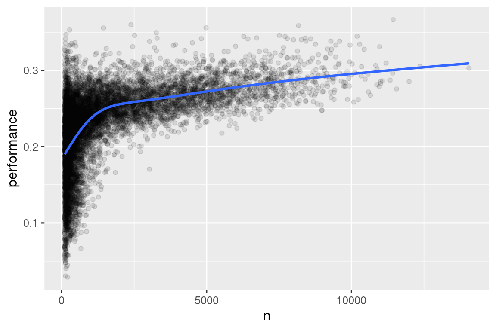

# Data transformation

## 介绍

可视化是生成洞察力的重要工具，但很少有情况下你会得到完全符合你所需的图形的数据形式。通常情况下，你需要创建一些新的变量或摘要来回答你的数据问题，或者你可能只想重命名变量或重新排序观察结果，以使数据更容易处理。在本章中，你将学习如何做到这一点（以及更多！），这将通过使用 **dplyr** 包和一个新的数据集介绍数据转换，该数据集包含了 2013 年从纽约市起飞的航班信息。

本章的目标是为你概述转换数据框的所有关键工具。我们将从操作数据框的行和列的函数开始，然后回过头来更多地讨论管道，这是一个将动词组合在一起的重要工具。然后我们将介绍使用分组的能力。我们将在章节结束时通过一个案例研究来展示这些功能，并在后续章节中更详细地讨论这些功能，因为我们开始深入研究特定类型的数据（例如数字、字符串、日期）。

### 先决条件

在本章中，我们将重点介绍 dplyr 包，这是 tidyverse 的另一个核心成员。我们将使用 nycflights13 包中的数据来说明关键思想，并使用 ggplot2 来帮助我们理解数据。

```R
library(nycflights13)
library(tidyverse)
#> ── Attaching core tidyverse packages ───────────────────── tidyverse 2.0.0 ──
#> ✔ dplyr     1.1.4     ✔ readr     2.1.5
#> ✔ forcats   1.0.0     ✔ stringr   1.5.1
#> ✔ ggplot2   3.5.1     ✔ tibble    3.2.1
#> ✔ lubridate 1.9.3     ✔ tidyr     1.3.1
#> ✔ purrr     1.0.2     
#> ── Conflicts ─────────────────────────────────────── tidyverse_conflicts() ──
#> ✖ dplyr::filter() masks stats::filter()
#> ✖ dplyr::lag()    masks stats::lag()
#> ℹ Use the conflicted package (<http://conflicted.r-lib.org/>) to force all conflicts to become errors
```

请仔细注意加载 tidyverse 时打印的冲突消息。它告诉你 dplyr 覆盖了基础 R 中的一些函数。如果你想在加载 dplyr 后使用这些函数的基础版本，你需要使用它们的完整名称：stats::filter() 和 stats::lag()。到目前为止，我们大多忽略了函数来自哪个包，因为大多数情况下这并不重要。然而，知道函数来自哪个包可以帮助你找到帮助和相关函数，所以当我们需要准确指定函数来自哪个包时，我们将使用与 R 相同的语法：packagename::functionname()。

### nycflights13

为了探索基本的 dplyr 动词，我们将使用 nycflights13::flights。这个数据集包含了 2013 年从纽约市出发的所有 336,776 趟航班。数据来自[美国运输统计局](https://www.transtats.bts.gov/DL_SelectFields.aspx?gnoyr_VQ=FGJ&QO_fu146_anzr=b0-gvzr)，并在 ?flights 中有文档记录。

```R
flights
#> # A tibble: 336,776 × 19
#>    year month   day dep_time sched_dep_time dep_delay arr_time sched_arr_time
#>   <int> <int> <int>    <int>          <int>     <dbl>    <int>          <int>
#> 1  2013     1     1      517            515         2      830            819
#> 2  2013     1     1      533            529         4      850            830
#> 3  2013     1     1      542            540         2      923            850
#> 4  2013     1     1      544            545        -1     1004           1022
#> 5  2013     1     1      554            600        -6      812            837
#> 6  2013     1     1      554            558        -4      740            728
#> # ℹ 336,770 more rows
#> # ℹ 11 more variables: arr_delay <dbl>, carrier <chr>, flight <int>, …
```

flights 是一个 tibble，是 tidyverse 中使用的一种特殊类型的数据框，用于避免一些常见的陷阱。tibble 和数据框之间最重要的区别在于它们的打印方式；它们设计用于大型数据集，因此它们只显示前几行和一屏幕上适合的列。有几种方法可以查看全部内容。如果你正在使用 RStudio，最方便的方法可能是使用 View(flights)，它将打开一个交互式的可滚动和可过滤的视图。否则，你可以使用 print(flights, width = Inf) 来显示所有列，或者使用 glimpse()：

```R
glimpse(flights)
#> Rows: 336,776
#> Columns: 19
#> $ year           <int> 2013, 2013, 2013, 2013, 2013, 2013, 2013, 2013, 2013…
#> $ month          <int> 1, 1, 1, 1, 1, 1, 1, 1, 1, 1, 1, 1, 1, 1, 1, 1, 1, 1…
#> $ day            <int> 1, 1, 1, 1, 1, 1, 1, 1, 1, 1, 1, 1, 1, 1, 1, 1, 1, 1…
#> $ dep_time       <int> 517, 533, 542, 544, 554, 554, 555, 557, 557, 558, 55…
#> $ sched_dep_time <int> 515, 529, 540, 545, 600, 558, 600, 600, 600, 600, 60…
#> $ dep_delay      <dbl> 2, 4, 2, -1, -6, -4, -5, -3, -3, -2, -2, -2, -2, -2,…
#> $ arr_time       <int> 830, 850, 923, 1004, 812, 740, 913, 709, 838, 753, 8…
#> $ sched_arr_time <int> 819, 830, 850, 1022, 837, 728, 854, 723, 846, 745, 8…
#> $ arr_delay      <dbl> 11, 20, 33, -18, -25, 12, 19, -14, -8, 8, -2, -3, 7,…
#> $ carrier        <chr> "UA", "UA", "AA", "B6", "DL", "UA", "B6", "EV", "B6"…
#> $ flight         <int> 1545, 1714, 1141, 725, 461, 1696, 507, 5708, 79, 301…
#> $ tailnum        <chr> "N14228", "N24211", "N619AA", "N804JB", "N668DN", "N…
#> $ origin         <chr> "EWR", "LGA", "JFK", "JFK", "LGA", "EWR", "EWR", "LG…
#> $ dest           <chr> "IAH", "IAH", "MIA", "BQN", "ATL", "ORD", "FLL", "IA…
#> $ air_time       <dbl> 227, 227, 160, 183, 116, 150, 158, 53, 140, 138, 149…
#> $ distance       <dbl> 1400, 1416, 1089, 1576, 762, 719, 1065, 229, 944, 73…
#> $ hour           <dbl> 5, 5, 5, 5, 6, 5, 6, 6, 6, 6, 6, 6, 6, 6, 6, 5, 6, 6…
#> $ minute         <dbl> 15, 29, 40, 45, 0, 58, 0, 0, 0, 0, 0, 0, 0, 0, 0, 59…
#> $ time_hour      <dttm> 2013-01-01 05:00:00, 2013-01-01 05:00:00, 2013-01-0…
```

在这两个视图中，变量名称后面跟着缩写，告诉你每个变量的类型：<int> 是整数的缩写，<dbl> 是 double（也称为实数），<chr> 是字符的缩写（也称为字符串），<dttm> 是日期时间的缩写。这些很重要，因为你可以对列执行的操作很大程度上取决于其“类型”。

### dplyr基础

你即将学习到主要的 dplyr 动词（函数），这将使你能够解决绝大多数数据处理挑战。但在讨论它们的个别差异之前，值得指出它们共同的特点：

1. 第一个参数始终是数据框。
2. 后续的参数通常描述要操作的列，使用变量名称（不使用引号）。
3. 输出始终是一个新的数据框。

因为每个动词都可以很好地执行一件事情，所以解决复杂的问题通常需要组合多个动词，我们将使用管道，|>。我们将在第 3.4 节中更详细地讨论管道，但简单来说，管道将其左侧的内容传递给其右侧的函数，因此 x |> f(y) 等同于 f(x, y)，x |> f(y) |> g(z) 等同于 g(f(x, y), z)。读音最简单的方法是“then”。这使得即使你尚未学习细节，也可以理解以下代码的意义：

```R
flights |>
  filter(dest == "IAH") |> 
  group_by(year, month, day) |> 
  summarize(
    arr_delay = mean(arr_delay, na.rm = TRUE)
  )
```

dplyr 的动词根据它们操作的内容分为四组：**行**、**列**、**组**或**表**。在接下来的章节中，你将学习到行、列和分组的最重要的动词，然后我们将在第 19 章中回顾作用于表的连接动词。让我们开始吧！

## 行

操作数据集行的最重要的动词是 filter() 和 arrange()。filter() 根据列的值保留行，而 arrange() 则根据行的值对行进行排序。这两个函数只影响行，列保持不变。我们还会讨论 distinct()，它找到具有唯一值的行，但与 arrange() 和 filter() 不同，它还可以选择性地修改列。

### filter()

filter() 允许你根据列的值保留行。第一个参数是数据框。第二个及后续的参数是必须为真以保留行的条件。例如，我们可以找到所有出发晚于 120 分钟（两小时）的航班：

```R
flights |> 
  filter(dep_delay > 120)
#> # A tibble: 9,723 × 19
#>    year month   day dep_time sched_dep_time dep_delay arr_time sched_arr_time
#>   <int> <int> <int>    <int>          <int>     <dbl>    <int>          <int>
#> 1  2013     1     1      848           1835       853     1001           1950
#> 2  2013     1     1      957            733       144     1056            853
#> 3  2013     1     1     1114            900       134     1447           1222
#> 4  2013     1     1     1540           1338       122     2020           1825
#> 5  2013     1     1     1815           1325       290     2120           1542
#> 6  2013     1     1     1842           1422       260     1958           1535
#> # ℹ 9,717 more rows
#> # ℹ 11 more variables: arr_delay <dbl>, carrier <chr>, flight <int>, …
```

除了 >（大于）外，你还可以使用 >=（大于或等于）、<（小于）、<=（小于或等于）、==（等于）和 !=（不等于）等条件。你还可以使用 & 或 , 来组合条件，表示“和”（检查两个条件），或使用 | 表示“或”（检查任一条件）：

```R
# Flights that departed on January 1
flights |> 
  filter(month == 1 & day == 1)
#> # A tibble: 842 × 19
#>    year month   day dep_time sched_dep_time dep_delay arr_time sched_arr_time
#>   <int> <int> <int>    <int>          <int>     <dbl>    <int>          <int>
#> 1  2013     1     1      517            515         2      830            819
#> 2  2013     1     1      533            529         4      850            830
#> 3  2013     1     1      542            540         2      923            850
#> 4  2013     1     1      544            545        -1     1004           1022
#> 5  2013     1     1      554            600        -6      812            837
#> 6  2013     1     1      554            558        -4      740            728
#> # ℹ 836 more rows
#> # ℹ 11 more variables: arr_delay <dbl>, carrier <chr>, flight <int>, …

# Flights that departed in January or February
flights |> 
  filter(month == 1 | month == 2)
#> # A tibble: 51,955 × 19
#>    year month   day dep_time sched_dep_time dep_delay arr_time sched_arr_time
#>   <int> <int> <int>    <int>          <int>     <dbl>    <int>          <int>
#> 1  2013     1     1      517            515         2      830            819
#> 2  2013     1     1      533            529         4      850            830
#> 3  2013     1     1      542            540         2      923            850
#> 4  2013     1     1      544            545        -1     1004           1022
#> 5  2013     1     1      554            600        -6      812            837
#> 6  2013     1     1      554            558        -4      740            728
#> # ℹ 51,949 more rows
#> # ℹ 11 more variables: arr_delay <dbl>, carrier <chr>, flight <int>, …
```

当你结合 | 和 == 时有一个有用的快捷方式：%in%。它会保留变量等于右侧值之一的行：

```R
# A shorter way to select flights that departed in January or February
flights |> 
  filter(month %in% c(1, 2))
#> # A tibble: 51,955 × 19
#>    year month   day dep_time sched_dep_time dep_delay arr_time sched_arr_time
#>   <int> <int> <int>    <int>          <int>     <dbl>    <int>          <int>
#> 1  2013     1     1      517            515         2      830            819
#> 2  2013     1     1      533            529         4      850            830
#> 3  2013     1     1      542            540         2      923            850
#> 4  2013     1     1      544            545        -1     1004           1022
#> 5  2013     1     1      554            600        -6      812            837
#> 6  2013     1     1      554            558        -4      740            728
#> # ℹ 51,949 more rows
#> # ℹ 11 more variables: arr_delay <dbl>, carrier <chr>, flight <int>, …
```

我们将在第 12 章中更详细地回顾这些比较和逻辑运算符。

当你运行 filter() 时，dplyr 执行过滤操作，创建一个新的数据框，然后将其打印出来。它不会修改现有的 flights 数据集，因为 dplyr 函数从不修改它们的输入。要保存结果，你需要使用赋值运算符 <-:

```R
jan1 <- flights |> 
  filter(month == 1 & day == 1)
```

### 常见错误
当你刚开始使用 R 时，最容易犯的错误是在测试相等性时使用 = 而不是 ==。filter() 会在发生这种情况时通知你：

```R
flights |> 
  filter(month = 1)
#> Error in `filter()`:
#> ! We detected a named input.
#> ℹ This usually means that you've used `=` instead of `==`.
#> ℹ Did you mean `month == 1`?
```

另一个错误是将“或”语句写成英语中的样子：

```R
flights |> 
  filter(month == 1 | 2)
```

在没有引发错误的意义上，这种方法“会奏效”，但不会和想象中的效一致，因为 | 首先检查 month == 1 条件，然后检查条件 2，这不是一个明智的条件。我们将在第 12.3.2 节中更详细地了解到这里发生了什么以及为什么。

### arrange()

arrange() 根据列的值更改行的顺序。它接受一个数据框和一组列名（或更复杂的表达式）进行排序。如果你提供多个列名，每个额外的列将用于在前面列的值中打破关系。例如，以下代码按出发时间排序，出发时间分布在四列中。我们首先得到最早的年份，然后是每年最早的月份等。

```R
flights |> 
  arrange(year, month, day, dep_time)
#> # A tibble: 336,776 × 19
#>    year month   day dep_time sched_dep_time dep_delay arr_time sched_arr_time
#>   <int> <int> <int>    <int>          <int>     <dbl>    <int>          <int>
#> 1  2013     1     1      517            515         2      830            819
#> 2  2013     1     1      533            529         4      850            830
#> 3  2013     1     1      542            540         2      923            850
#> 4  2013     1     1      544            545        -1     1004           1022
#> 5  2013     1     1      554            600        -6      812            837
#> 6  2013     1     1      554            558        -4      740            728
#> # ℹ 336,770 more rows
#> # ℹ 11 more variables: arr_delay <dbl>, carrier <chr>, flight <int>, …
```

你可以在 arrange() 内部的列上使用 desc() 以按降序（从大到小）重新排序数据框。例如，此代码按航班延误时间从最长到最短排序：

```R
flights |> 
  arrange(desc(dep_delay))
#> # A tibble: 336,776 × 19
#>    year month   day dep_time sched_dep_time dep_delay arr_time sched_arr_time
#>   <int> <int> <int>    <int>          <int>     <dbl>    <int>          <int>
#> 1  2013     1     9      641            900      1301     1242           1530
#> 2  2013     6    15     1432           1935      1137     1607           2120
#> 3  2013     1    10     1121           1635      1126     1239           1810
#> 4  2013     9    20     1139           1845      1014     1457           2210
#> 5  2013     7    22      845           1600      1005     1044           1815
#> 6  2013     4    10     1100           1900       960     1342           2211
#> # ℹ 336,770 more rows
#> # ℹ 11 more variables: arr_delay <dbl>, carrier <chr>, flight <int>, …
```

请注意，行数并未改变 - 我们只是排列数据，而不是过滤它。

### distinct()

`distinct()` 函数用于在数据集中找到所有唯一的行，因此从技术上讲，它主要作用于行。然而，大多数情况下，你可能希望得到某些变量的唯一组合，因此你也可以选择提供列名：

```R
# Remove duplicate rows, if any
flights |> 
  distinct()
#> # A tibble: 336,776 × 19
#>    year month   day dep_time sched_dep_time dep_delay arr_time sched_arr_time
#>   <int> <int> <int>    <int>          <int>     <dbl>    <int>          <int>
#> 1  2013     1     1      517            515         2      830            819
#> 2  2013     1     1      533            529         4      850            830
#> 3  2013     1     1      542            540         2      923            850
#> 4  2013     1     1      544            545        -1     1004           1022
#> 5  2013     1     1      554            600        -6      812            837
#> 6  2013     1     1      554            558        -4      740            728
#> # ℹ 336,770 more rows
#> # ℹ 11 more variables: arr_delay <dbl>, carrier <chr>, flight <int>, …

# Find all unique origin and destination pairs
flights |> 
  distinct(origin, dest)
#> # A tibble: 224 × 2
#>   origin dest 
#>   <chr>  <chr>
#> 1 EWR    IAH  
#> 2 LGA    IAH  
#> 3 JFK    MIA  
#> 4 JFK    BQN  
#> 5 LGA    ATL  
#> 6 EWR    ORD  
#> # ℹ 218 more rows
```

或者，如果你想在过滤唯一行时保留其他列，可以使用`.keep_all = TRUE`选项。

```R
flights |> 
  distinct(origin, dest, .keep_all = TRUE)
#> # A tibble: 224 × 19
#>    year month   day dep_time sched_dep_time dep_delay arr_time sched_arr_time
#>   <int> <int> <int>    <int>          <int>     <dbl>    <int>          <int>
#> 1  2013     1     1      517            515         2      830            819
#> 2  2013     1     1      533            529         4      850            830
#> 3  2013     1     1      542            540         2      923            850
#> 4  2013     1     1      544            545        -1     1004           1022
#> 5  2013     1     1      554            600        -6      812            837
#> 6  2013     1     1      554            558        -4      740            728
#> # ℹ 218 more rows
#> # ℹ 11 more variables: arr_delay <dbl>, carrier <chr>, flight <int>, …
```

不巧的是，所有这些不同的航班都在 1 月 1 日：`distinct()`会找到数据集中唯一行的第一次出现，并且丢弃其他行。

如果你想找出出现的次数，则最好将 `distinct()` 替换为 `count()`，并使用 `sort = TRUE` 参数将其按出现次数降序排列。你将在第 13.3 节中了解更多关于 `count()` 的内容。

```R
flights |>
  count(origin, dest, sort = TRUE)
#> # A tibble: 224 × 3
#>   origin dest      n
#>   <chr>  <chr> <int>
#> 1 JFK    LAX   11262
#> 2 LGA    ATL   10263
#> 3 LGA    ORD    8857
#> 4 JFK    SFO    8204
#> 5 LGA    CLT    6168
#> 6 EWR    ORD    6100
#> # ℹ 218 more rows
```

### 练习

1. 在每个条件下，使用单个管道找到满足条件的所有航班：

  - 具有两个或更多小时到达延误的航班
  - 飞往休斯敦（IAH或HOU）的航班
  - 由美国联合航空（United）、美国航空（American）或达美航空（Delta）运营的航班
  - 在夏季（七月、八月和九月）出发的航班
  - 到达延误超过两个小时，但未晚点出发的航班
  - 延误至少一小时，但在飞行中弥补了超过30分钟的航班

2. 排序航班以找到出发延误最长的航班。找到凌晨出发的航班。

3. 对航班进行排序以找到最快的航班。（提示：尝试在函数内部包含数学计算。）

4. 2013年的每一天都有航班吗？

5. 哪些航班飞行距离最远？哪些飞行距离最短？

6. 如果同时使用 filter() 和 arrange()，使用顺序是否重要？为什么/为什么不？思考结果以及函数需要执行的工作量。

## 列

有四个重要的动词影响着列而不改变行：mutate()创建新列，这些列是从现有列派生的；select() 更改存在的列；rename() 更改列的名称；relocate() 更改列的位置。

### mutate()

mutate() 的作用是添加新的列，这些列是从现有列计算得出的。在后面的章节中，你将学习一系列函数，这些函数可以用来操作不同类型的变量。现在，我们将使用基本的代数，计算延误航班在空中弥补的时间以及以英里每小时为单位的速度：

```R
flights |> 
  mutate(
    gain = dep_delay - arr_delay,
    speed = distance / air_time * 60
  )
#> # A tibble: 336,776 × 21
#>    year month   day dep_time sched_dep_time dep_delay arr_time sched_arr_time
#>   <int> <int> <int>    <int>          <int>     <dbl>    <int>          <int>
#> 1  2013     1     1      517            515         2      830            819
#> 2  2013     1     1      533            529         4      850            830
#> 3  2013     1     1      542            540         2      923            850
#> 4  2013     1     1      544            545        -1     1004           1022
#> 5  2013     1     1      554            600        -6      812            837
#> 6  2013     1     1      554            558        -4      740            728
#> # ℹ 336,770 more rows
#> # ℹ 13 more variables: arr_delay <dbl>, carrier <chr>, flight <int>, …
```

默认情况下，mutate()会将新列添加到数据集的右侧，这样很难看到发生了什么。我们可以使用 .before 参数将变量添加到左侧：

```R
flights |> 
  mutate(
    gain = dep_delay - arr_delay,
    speed = distance / air_time * 60,
    .before = 1
  )
#> # A tibble: 336,776 × 21
#>    gain speed  year month   day dep_time sched_dep_time dep_delay arr_time
#>   <dbl> <dbl> <int> <int> <int>    <int>          <int>     <dbl>    <int>
#> 1    -9  370.  2013     1     1      517            515         2      830
#> 2   -16  374.  2013     1     1      533            529         4      850
#> 3   -31  408.  2013     1     1      542            540         2      923
#> 4    17  517.  2013     1     1      544            545        -1     1004
#> 5    19  394.  2013     1     1      554            600        -6      812
#> 6   -16  288.  2013     1     1      554            558        -4      740
#> # ℹ 336,770 more rows
#> # ℹ 12 more variables: sched_arr_time <int>, arr_delay <dbl>, …
```

默认情况下，mutate() 将新列添加到数据集的右侧，这使得很难看到正在发生的情况。我们可以使用 .before 参数将变量添加到左侧：

```R
flights |> 
  mutate(
    gain = dep_delay - arr_delay,
    speed = distance / air_time * 60,
    .before = 1
  )
#> # A tibble: 336,776 × 21
#>    gain speed  year month   day dep_time sched_dep_time dep_delay arr_time
#>   <dbl> <dbl> <int> <int> <int>    <int>          <int>     <dbl>    <int>
#> 1    -9  370.  2013     1     1      517            515         2      830
#> 2   -16  374.  2013     1     1      533            529         4      850
#> 3   -31  408.  2013     1     1      542            540         2      923
#> 4    17  517.  2013     1     1      544            545        -1     1004
#> 5    19  394.  2013     1     1      554            600        -6      812
#> 6   -16  288.  2013     1     1      554            558        -4      740
#> # ℹ 336,770 more rows
#> # ℹ 12 more variables: sched_arr_time <int>, arr_delay <dbl>, …
```

句点 "." 是表示 .before 是函数的一个参数，而不是我们正在创建的第三个新变量的名称。你还可以使用 .after 在变量后添加，而在 .before 和 .after 中，你可以使用变量名称而不是位置。例如，我们可以在 day 后添加新变量：

```R
flights |> 
  mutate(
    gain = dep_delay - arr_delay,
    speed = distance / air_time * 60,
    .after = day
  )
```

或者，你可以使用 .keep 参数控制保留哪些变量。一个特别有用的参数是 "used"，它指定我们只保留在 mutate() 步骤中涉及或创建的列。例如，以下输出将仅包含 dep_delay、arr_delay、air_time、gain、hours 和 gain_per_hour 这些变量。

```R
flights |> 
  mutate(
    gain = dep_delay - arr_delay,
    hours = air_time / 60,
    gain_per_hour = gain / hours,
    .keep = "used"
  )
```

请注意，由于我们没有将上述计算的结果分配回 flights，因此新变量 gain、hours 和 gain_per_hour 将仅被打印出来，而不会存储在数据框中。如果我们希望它们在将来的使用中可用于数据框，我们应该仔细考虑是否希望将结果分配回 flights，从而覆盖具有更多变量的原始数据框，或者分配到一个新对象中。通常，正确的答案是分配到一个命名有意义的新对象中，以指示其内容，例如 delay_gain，但你也可能有充分的理由来覆盖 flights。

### select() 

在获取到包含数百甚至数千个变量的数据集时并不罕见。在这种情况下，首要挑战通常是集中关注你感兴趣的变量。select() 允许你使用基于变量名称的操作快速缩小到一个有用的子集：

- 按名称选择列：

  ```r
  flights |> 
    select(year, month, day)
  ```

- 选择所有在 year 和 day 之间的列（包括它们自己）：

  ```r
  flights |> 
    select(year:day)
  ```

- 选择除了从 year 到 day（包括它们自己）之间的所有列：

  ```r
  flights |> 
    select(!year:day)
  ```

  在历史上，这个操作是用 - 代替 ! 完成的，所以你可能会在实践中看到。这两个运算符具有相同的目的，但行为上有微妙的差异。我们建议使用 !，因为它读起来像 "不"，并且与 & 和 | 很好地结合。

- 选择所有字符型的列：

  ```r
  flights |> 
    select(where(is.character))
  ```

在 select() 中，你可以使用一些辅助函数：

- starts_with("abc")：匹配以 "abc" 开头的名称。
- ends_with("xyz")：匹配以 "xyz" 结尾的名称。
- contains("ijk")：匹配包含 "ijk" 的名称。
- num_range("x", 1:3)：匹配 x1、x2 和 x3。

有关更多详细信息，请参阅 ?select。一旦你了解了正则表达式（第 15 章的主题），你还可以使用 matches() 来选择与模式匹配的变量。

你可以在选择变量时重命名它们，方法是使用 =。新名称出现在 = 的左侧，旧变量出现在右侧：

```r
flights |> 
  select(tail_num = tailnum)
#> # A tibble: 336,776 × 1
#>   tail_num
#>   <chr>   
#> 1 N14228  
#> 2 N24211  
#> 3 N619AA  
#> 4 N804JB  
#> 5 N668DN  
#> 6 N39463  
#> # ℹ 336,770 more rows
```

### rename() 
如果你想保留所有现有变量，只想重命名其中几个，你可以使用 rename() 而不是 select()：

```R
flights |> 
  rename(tail_num = tailnum)
#> # A tibble: 336,776 × 19
#>    year month   day dep_time sched_dep_time dep_delay arr_time sched_arr_time
#>   <int> <int> <int>    <int>          <int>     <dbl>    <int>          <int>
#> 1  2013     1     1      517            515         2      830            819
#> 2  2013     1     1      533            529         4      850            830
#> 3  2013     1     1      542            540         2      923            850
#> 4  2013     1     1      544            545        -1     1004           1022
#> 5  2013     1     1      554            600        -6      812            837
#> 6  2013     1     1      554            558        -4      740            728
#> # ℹ 336,770 more rows
#> # ℹ 11 more variables: arr_delay <dbl>, carrier <chr>, flight <int>, …
```

如果你有一堆不一致命名的列，手动修复它们可能会很痛苦，可以尝试使用 janitor::clean_names()，它提供了一些有用的自动清理功能。

### relocate() 
使用 relocate() 来移动变量。你可能希望将相关变量放在一起或将重要变量移动到前面。默认情况下，relocate() 将变量移动到前面：

```R
flights |> 
  relocate(time_hour, air_time)
#> # A tibble: 336,776 × 19
#>   time_hour           air_time  year month   day dep_time sched_dep_time
#>   <dttm>                 <dbl> <int> <int> <int>    <int>          <int>
#> 1 2013-01-01 05:00:00      227  2013     1     1      517            515
#> 2 2013-01-01 05:00:00      227  2013     1     1      533            529
#> 3 2013-01-01 05:00:00      160  2013     1     1      542            540
#> 4 2013-01-01 05:00:00      183  2013     1     1      544            545
#> 5 2013-01-01 06:00:00      116  2013     1     1      554            600
#> 6 2013-01-01 05:00:00      150  2013     1     1      554            558
#> # ℹ 336,770 more rows
#> # ℹ 12 more variables: dep_delay <dbl>, arr_time <int>, …
```

你也可以使用 .before 和 .after 参数指定要放置它们的位置，就像在 mutate() 中一样：

```r
flights |> 
  relocate(year:dep_time, .after = time_hour)

flights |> 
  relocate(starts_with("arr"), .before = dep_time)
```

### 练习

1. 比较 dep_time、sched_dep_time 和 dep_delay。你认为这三个数字会如何相关？

2. 思考一下从 flights 中选择 dep_time、dep_delay、arr_time 和 arr_delay 的多种方法。

3. 如果在 select() 调用中多次指定相同变量的名称会发生什么？

4. any_of() 函数是做什么的？与此向量结合使用可能有什么好处？

  ```R
  variables <- c("year", "month", "day", "dep_delay", "arr_delay")
  ```

5. 运行以下代码的结果是否让你感到惊讶？默认情况下，select 帮助函数如何处理大写和小写？你如何更改该默认设置？

```R
flights |> select(contains("TIME"))
```

6. 将 air_time 重命名为 air_time_min 以指示测量单位，并将其移动到数据框的开头。

7. 以下代码为什么不起作用，错误信息是什么意思？

```r
flights |> 
  select(tailnum) |> 
  arrange(arr_delay)
#> Error in `arrange()`:
#> ℹ In argument: `..1 = arr_delay`.
#> Caused by error:
#> ! object 'arr_delay' not found
```

## 管道

我们已经展示了管道的简单示例，但它的真正威力在于开始组合多个动词。例如，想象一下，你想要找到飞往休斯顿IAH机场的最快航班：你需要组合使用filter()、mutate()、select()和arrange()：

```R
flights |> 
  filter(dest == "IAH") |> 
  mutate(speed = distance / air_time * 60) |> 
  select(year:day, dep_time, carrier, flight, speed) |> 
  arrange(desc(speed))
#> # A tibble: 7,198 × 7
#>    year month   day dep_time carrier flight speed
#>   <int> <int> <int>    <int> <chr>    <int> <dbl>
#> 1  2013     7     9      707 UA         226  522.
#> 2  2013     8    27     1850 UA        1128  521.
#> 3  2013     8    28      902 UA        1711  519.
#> 4  2013     8    28     2122 UA        1022  519.
#> 5  2013     6    11     1628 UA        1178  515.
#> 6  2013     8    27     1017 UA         333  515.
#> # ℹ 7,192 more rows
```

即使这个管道有四个步骤，它也很容易浏览，因为动词出现在每一行的开头：从flights数据开始，然后过滤，然后变异，然后选择，然后排列。

如果我们没有管道会发生什么？我们可以在前一个调用内嵌套每个函数调用：

```R
arrange(
  select(
    mutate(
      filter(
        flights, 
        dest == "IAH"
      ),
      speed = distance / air_time * 60
    ),
    year:day, dep_time, carrier, flight, speed
  ),
  desc(speed)
)
```

或者我们可以使用一堆中间对象：

```R
flights1 <- filter(flights, dest == "IAH")
flights2 <- mutate(flights1, speed = distance / air_time * 60)
flights3 <- select(flights2, year:day, dep_time, carrier, flight, speed)
arrange(flights3, desc(speed))
```

虽然两种形式都有各自的时机和场合，但管道通常产生的数据分析代码更容易编写和阅读。

要将管道添加到你的代码中，我们建议使用内置的键盘快捷键Ctrl/Cmd + Shift + M。你需要对RStudio选项进行一次更改，以使用 |> 而不是 %>%，如[图一](#fig1)所示；稍后会详细介绍 %>%。

<figure id="fig1">
  
  <figcaption>图一：要插入 |>，请确保选中“使用原生管道运算符”选项。</figcaption>
</figure>

> magrittr
> 如果你已经使用 tidyverse 一段时间，你可能对 magrittr 包提供的 %>% 管道操作符比较熟悉。magrittr 包是 tidyverse 核心组件的一部分，所以你可以在加载 tidyverse 时使用 %>%：

  ```r
  library(tidyverse)

  mtcars %>% 
    group_by(cyl) %>%
    summarize(n = n())
  ```

  > 对于简单情况，|> 和 %>% 的行为是相同的。那么为什么我们推荐使用基础管道操作符呢？首先，因为它是基础 R 的一部分，所以你始终可以使用它，即使你没有使用 tidyverse 也可以。其次，|> 比 %>% 简单得多：在 %>% 于2014年问世以及 |>(R 4.1.0 于2021年被引入)之间的时间里，我们对管道操作符有了更好的理解。这使得基础实现能够摒弃不常用和不太重要的功能。

## groups

到目前为止，你已经学习了如何使用处理行和列的函数。当你加入能够处理分组的功能时，dplyr 变得更加强大。在本节中，我们将重点介绍最重要的函数：group_by()、summarize()，以及切片函数系列。

### group_by() 

使用 group_by() 将数据集分成对你的分析有意义的组：

```R
flights |> 
  group_by(month)
#> # A tibble: 336,776 × 19
#> # Groups:   month [12]
#>    year month   day dep_time sched_dep_time dep_delay arr_time sched_arr_time
#>   <int> <int> <int>    <int>          <int>     <dbl>    <int>          <int>
#> 1  2013     1     1      517            515         2      830            819
#> 2  2013     1     1      533            529         4      850            830
#> 3  2013     1     1      542            540         2      923            850
#> 4  2013     1     1      544            545        -1     1004           1022
#> 5  2013     1     1      554            600        -6      812            837
#> 6  2013     1     1      554            558        -4      740            728
#> # ℹ 336,770 more rows
#> # ℹ 11 more variables: arr_delay <dbl>, carrier <chr>, flight <int>, …
```

group_by() 不会改变数据，但是如果你仔细观察输出，你会注意到输出表明它是“按月分组的”（Groups: month [12]）。这意味着后续的操作现在将“按月份”进行。group_by() 将这个分组特性（称为类）添加到数据框中，这会改变应用于数据的后续动词的行为。

### summarize() 

最重要的分组操作之一是汇总，如果用于计算单个汇总统计量，则将数据框减少为每个组的单个行。在 dplyr 中，这个操作由 summarize() 执行，如下例所示，计算了每月的平均出发延误时间：

```r
flights |> 
  group_by(month) |> 
  summarize(
    avg_delay = mean(dep_delay)
  )
#> # A tibble: 12 × 2
#>   month avg_delay
#>   <int>     <dbl>
#> 1     1        NA
#> 2     2        NA
#> 3     3        NA
#> 4     4        NA
#> 5     5        NA
#> 6     6        NA
#> # ℹ 6 more rows
```

哎呀！出了些问题，我们所有的结果都是 NA（发音为“N-A”），在 R 中表示缺失值的符号。这是因为观察到的一些航班在延误列中有缺失数据，因此当我们计算平均值时，包括这些值，我们得到一个 NA 的结果。我们将在第 18 章详细讨论缺失值，但现在我们告诉 mean() 函数忽略所有缺失值，将参数 na.rm 设置为 TRUE：

```R
flights |> 
  group_by(month) |> 
  summarize(
    avg_delay = mean(dep_delay, na.rm = TRUE)
  )
#> # A tibble: 12 × 2
#>   month avg_delay
#>   <int>     <dbl>
#> 1     1      10.0
#> 2     2      10.8
#> 3     3      13.2
#> 4     4      13.9
#> 5     5      13.0
#> 6     6      20.8
#> # ℹ 6 more rows
```

你可以在单个 summarize() 调用中创建任意数量的汇总。你将在即将到来的章节中学习各种有用的汇总，但一个非常有用的汇总是 n()，它返回每个组中的行数：

```R
flights |> 
  group_by(month) |> 
  summarize(
    avg_delay = mean(dep_delay, na.rm = TRUE), 
    n = n()
  )
#> # A tibble: 12 × 3
#>   month avg_delay     n
#>   <int>     <dbl> <int>
#> 1     1      10.0 27004
#> 2     2      10.8 24951
#> 3     3      13.2 28834
#> 4     4      13.9 28330
#> 5     5      13.0 28796
#> 6     6      20.8 28243
#> # ℹ 6 more rows
```

平均值和计数在数据科学中能发挥出令人惊讶的作用！

### slice_ 函数

有五个方便的函数允许你在每个组中提取特定的行：

- df |> slice_head(n = 1) 从每个组中取出第一行。
- df |> slice_tail(n = 1) 从每个组中取出最后一行。
- df |> slice_min(x, n = 1) 取出列 x 的最小值所在的行。
- df |> slice_max(x, n = 1) 取出列 x 的最大值所在的行。
- df |> slice_sample(n = 1) 随机选择一行。

你可以改变 n 来选择多于一行，或者使用 prop = 0.1 来选择（例如）每个组中的 10％ 行。例如，以下代码找到了每个目的地最延误到达的航班：

```R
flights |> 
  group_by(dest) |> 
  slice_max(arr_delay, n = 1) |>
  relocate(dest)
#> # A tibble: 108 × 19
#> # Groups:   dest [105]
#>   dest   year month   day dep_time sched_dep_time dep_delay arr_time
#>   <chr> <int> <int> <int>    <int>          <int>     <dbl>    <int>
#> 1 ABQ    2013     7    22     2145           2007        98      132
#> 2 ACK    2013     7    23     1139            800       219     1250
#> 3 ALB    2013     1    25      123           2000       323      229
#> 4 ANC    2013     8    17     1740           1625        75     2042
#> 5 ATL    2013     7    22     2257            759       898      121
#> 6 AUS    2013     7    10     2056           1505       351     2347
#> # ℹ 102 more rows
#> # ℹ 11 more variables: sched_arr_time <int>, arr_delay <dbl>, …
```

请注意，目的地有105个，但在这里我们得到了108行。怎么回事？slice_min()和slice_max()会保留并列值，因此n = 1意味着给我们所有具有最高值的行。如果你希望每组只有一行，可以设置with_ties = FALSE。

这类似于使用summarize()计算最大延迟，但是你会得到整个对应的行（如果有并列值，则会得到多行），而不是单个摘要统计。

### 按多个变量进行分组

你可以使用多个变量创建分组。例如，我们可以为每个日期创建一个分组。

```R
daily <- flights |>  
  group_by(year, month, day)
daily
#> # A tibble: 336,776 × 19
#> # Groups:   year, month, day [365]
#>    year month   day dep_time sched_dep_time dep_delay arr_time sched_arr_time
#>   <int> <int> <int>    <int>          <int>     <dbl>    <int>          <int>
#> 1  2013     1     1      517            515         2      830            819
#> 2  2013     1     1      533            529         4      850            830
#> 3  2013     1     1      542            540         2      923            850
#> 4  2013     1     1      544            545        -1     1004           1022
#> 5  2013     1     1      554            600        -6      812            837
#> 6  2013     1     1      554            558        -4      740            728
#> # ℹ 336,770 more rows
#> # ℹ 11 more variables: arr_delay <dbl>, carrier <chr>, flight <int>, …
```

当对一个由多个变量分组的 tibble 进行汇总时，每个汇总会去除最后一组。事后看来，这种方式并不是使该函数正常工作的好方法，但要在不破坏现有代码的情况下进行更改是很困难的。为了让这种情况变得明显，dplyr 显示了一条消息，告诉你可以如何更改这种行为:

```R
daily_flights <- daily |> 
  summarize(n = n())
#> `summarise()` has grouped output by 'year', 'month'. You can override using
#> the `.groups` argument.
```

如果你对这种行为感到满意，你可以显式地请求它以抑制该消息:

```R
daily_flights <- daily |> 
  summarize(
    n = n(), 
    .groups = "drop_last"
  )
```

或者，通过设置不同的值，如 "drop" 来更改默认行为以删除所有分组，或者设置为 "keep" 以保留相同的分组。

### 取消分组

你可能还想要从数据框中删除分组，而不使用 summarize()。你可以使用 ungroup() 来做到这一点。

```R
daily |> 
  ungroup()
#> # A tibble: 336,776 × 19
#>    year month   day dep_time sched_dep_time dep_delay arr_time sched_arr_time
#>   <int> <int> <int>    <int>          <int>     <dbl>    <int>          <int>
#> 1  2013     1     1      517            515         2      830            819
#> 2  2013     1     1      533            529         4      850            830
#> 3  2013     1     1      542            540         2      923            850
#> 4  2013     1     1      544            545        -1     1004           1022
#> 5  2013     1     1      554            600        -6      812            837
#> 6  2013     1     1      554            558        -4      740            728
#> # ℹ 336,770 more rows
#> # ℹ 11 more variables: arr_delay <dbl>, carrier <chr>, flight <int>, …
```

现在让我们看看当你对一个未分组的数据框进行汇总时会发生什么。

```R
daily |> 
  ungroup() |>
  summarize(
    avg_delay = mean(dep_delay, na.rm = TRUE), 
    flights = n()
  )
#> # A tibble: 1 × 2
#>   avg_delay flights
#>       <dbl>   <int>
#> 1      12.6  336776
```

你会得到一行返回，因为 dplyr 将未分组数据框中的所有行都视为属于同一组。

### .by 

dplyr 1.1.0 版本引入了一个新的、实验性的语法，用于按操作进行分组，即 .by 参数。group_by() 和 ungroup() 并没有消失，但你现在也可以在单个操作中使用 .by 参数来进行分组：

```R
flights |> 
  summarize(
    delay = mean(dep_delay, na.rm = TRUE), 
    n = n(),
    .by = month
  )
```

或者，如果你想按多个变量进行分组：

```R
flights |> 
  summarize(
    delay = mean(dep_delay, na.rm = TRUE), 
    n = n(),
    .by = c(origin, dest)
  )
```

.by 适用于所有动词，并且有一个优点，就是你不需要使用 .groups 参数来抑制分组消息，也不需要在完成后使用 ungroup()。

在本章中，我们没有专注于这种语法，因为在我们撰写本书时，这种语法是非常新的。我们之所以要提及它，是因为我们认为它具有很多潜力，而且很可能会变得非常受欢迎。你可以在 [dplyr 1.1.0 博客文章](https://www.tidyverse.org/blog/2023/02/dplyr-1-1-0-per-operation-grouping/)中了解更多信息。

### 练习

1. 哪家航空公司的平均延误时间最长？挑战：你能分离出糟糕的机场和糟糕的航空公司的影响吗？为什么？（提示：考虑 flights |> group_by(carrier, dest) |> summarize(n())）

2. 找到每个目的地起飞时最延误的航班。

3. 一天之中，延误如何变化？用图表说明你的答案。

4. 如果向 slice_min() 和类似函数提供一个负的 n 会发生什么？

5. 根据你刚刚学到的 dplyr 动词，解释 count() 做了什么。count() 中的 sort 参数是什么作用？

6. 假设我们有以下小型数据框：

```R
df <- tibble(
  x = 1:5,
  y = c("a", "b", "a", "a", "b"),
  z = c("K", "K", "L", "L", "K")
)
```

  a. 写下你认为输出将会是什么样子，然后检查你是否正确，并描述group_by()函数的作用。
    ```R
    df |>
      group_by(y)
    ```

  b. 写下你认为输出将会是什么样子，然后检查你是否正确，并描述arrange()函数的作用。同时评论一下它与第（a）部分中的group_by()有何不同。

    ```R
    df |>
      arrange(y)
    ```

  c. 写下你认为输出将会是什么样子，然后检查你是否正确，并描述这个管道的作用。

    ```R
    df |>
      group_by(y) |>
      summarize(mean_x = mean(x))
    ```

  d. 写下你认为输出将会是什么样子，然后检查你是否正确，并描述这个管道的作用。然后，评论一下消息的含义。

    ```R
    df |>
      group_by(y, z) |>
      summarize(mean_x = mean(x))
    ```

  e. 写下你认为输出将会是什么样子，然后检查你是否正确，并描述这个管道的作用。它与第（d）部分中的输出有何不同？

    ```R
    df |>
      group_by(y, z) |>
      summarize(mean_x = mean(x), .groups = "drop")
    ```

  f. 写下你认为输出将会是什么样子，然后检查你是否正确，并描述每个管道的作用。这两个管道的输出有何不同？

    ```R
    df |>
      group_by(y, z) |>
      summarize(mean_x = mean(x))

    df |>
      group_by(y, z) |>
      mutate(mean_x = mean(x))
    ```

## 案例学习：聚合和样本数

每当你进行任何聚合操作时，都最好包括一个计数（n()）。这样，你就可以确保你的结论不是基于非常少的数据得出的。我们将使用 **Lahman** 包中的一些棒球数据来演示这一点。具体来说，我们将比较球员击中球（H）的比例与他们试图击中球（AB）的次数：

```R
batters <- Lahman::Batting |> 
  group_by(playerID) |> 
  summarize(
    performance = sum(H, na.rm = TRUE) / sum(AB, na.rm = TRUE),
    n = sum(AB, na.rm = TRUE)
  )
batters
#> # A tibble: 20,469 × 3
#>   playerID  performance     n
#>   <chr>           <dbl> <int>
#> 1 aardsda01      0          4
#> 2 aaronha01      0.305  12364
#> 3 aaronto01      0.229    944
#> 4 aasedo01       0          5
#> 5 abadan01       0.0952    21
#> 6 abadfe01       0.111      9
#> # ℹ 20,463 more rows
```

当我们绘制击球手的技能（以击球率performance衡量）与击球机会（以出局次数n衡量）时，你会看到两种模式：

1. 在出局次数较少的球员中，表现的变化更大。这种情况的图形形状非常特征明显：每当你绘制平均值（或其他摘要统计量）与组大小的关系图时，你会看到随着样本量增加，变异性减小。

2. 技能（performance）和击球机会（n）之间存在正相关关系，因为球队希望给他们最好的击球手最多的击球机会。

```R
batters |> 
  filter(n > 100) |> 
  ggplot(aes(x = n, y = performance)) +
  geom_point(alpha = 1 / 10) + 
  geom_smooth(se = FALSE)
```

<figure id="fig2">
  
</figure>

注意将ggplot2和dplyr结合起来的便捷模式。你只需要记得从|>，用于数据集处理，切换到+，用于向图中添加层。

这对于排名也有重要的影响。如果你简单地根据desc(performance)进行排序，那么击球率最高的人显然是那些试图击球很少次数却碰巧得分的人，他们不一定是最有技能的球员。

```R
batters |> 
  arrange(desc(performance))
#> # A tibble: 20,469 × 3
#>   playerID  performance     n
#>   <chr>           <dbl> <int>
#> 1 abramge01           1     1
#> 2 alberan01           1     1
#> 3 banisje01           1     1
#> 4 bartocl01           1     1
#> 5 bassdo01            1     1
#> 6 birasst01           1     2
#> # ℹ 20,463 more rows
```

你可以在 <http://varianceexplained.org/r/empirical_bayes_baseball/> 和 <https://www.evanmiller.org/how-not-to-sort-by-average-rating.html> 中找到关于这个问题以及如何解决它的很好的解释。

## 总结

在本章中，你学习了 dplyr 提供的用于处理数据框的工具。这些工具大致分为三类：操作行的工具（如 filter() 和 arrange()）、操作列的工具（如 select() 和 mutate()）以及操作分组的工具（如 group_by() 和 summarize()）。在本章中，我们重点介绍了这些“整个数据框”工具，但你还没有学到如何处理单个变量。我们将在本书的“转换”部分回到这个问题，每章将为你提供处理特定类型变量的工具。

在下一章中，我们将回到工作流程，讨论代码风格的重要性，保持代码的良好组织，以便使你和其他人能够轻松阅读和理解你的代码。