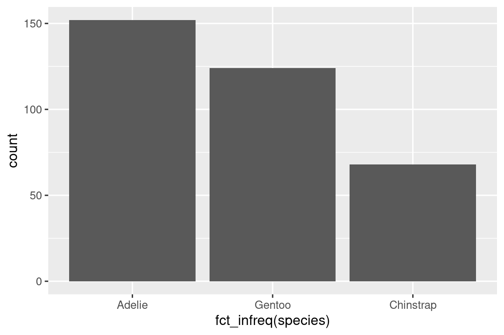

# 数据可视化
## 介绍

> “简单的图表给数据分析师带来的信息比任何其他工具都要多。” —— 约翰·图基

R 有几种制作图表的系统，但 ggplot2 是其中最优雅、最多才多艺的之一。ggplot2 实现了**图形语法**，这是一种描述和构建图表的连贯系统。有了 ggplot2，可以通过学习一个系统并将其应用于许多地方，使得你可以更快地做更多事情。

本章将教你如何使用 **ggplot2** 对数据进行可视化。我们将从创建一个简单的散点图开始，然后介绍美学映射和几何对象——这是 ggplot2 的基本构建模块。接着，我们将带你逐步了解如何可视化单个变量的分布以及可视化两个或多个变量之间的关系。最后，我们将结束于保存你的图表和故障排除提示。

### 先决条件
本章专注于 ggplot2，这是 tidyverse 中的核心包之一。要访问本章中使用的数据集、帮助页面和函数，请通过运行以下代码加载 tidyverse：

```R
library(tidyverse)
#> ── Attaching core tidyverse packages ───────────────────── tidyverse 2.0.0 ──
#> ✔ dplyr     1.1.4     ✔ readr     2.1.5
#> ✔ forcats   1.0.0     ✔ stringr   1.5.1
#> ✔ ggplot2   3.5.1     ✔ tibble    3.2.1
#> ✔ lubridate 1.9.3     ✔ tidyr     1.3.1
#> ✔ purrr     1.0.2     
#> ── Conflicts ─────────────────────────────────────── tidyverse_conflicts() ──
#> ✖ dplyr::filter() masks stats::filter()
#> ✖ dplyr::lag()    masks stats::lag()
#> ℹ Use the conflicted package (<http://conflicted.r-lib.org/>) to force all conflicts to become errors
```

这一行代码加载了核心 tidyverse；这些包几乎在每个数据分析中都会使用。它还告诉你 tidyverse 中的哪些函数与基本 R 中的函数（或你可能已加载的其他包中的函数）发生了冲突。

如果运行此代码时收到错误消息 `there is no package called 'tidyverse'`，则需要首先安装它，然后再次运行  `library()`。

```R
install.packages("tidyverse")
library(tidyverse)
```

一个包只需要安装一次，但每次启动新会话时都需要加载它。

除了 tidyverse，我们还将使用 **palmerpenguins** 包，其中包含了 Palmer 群岛三个岛上企鹅的体量测量数据集，以及 ggthemes 包，该包提供了适用于色盲的安全颜色调色板。

```R
library(palmerpenguins)
library(ggthemes)
```

## 初步步骤

长脚蹼的企鹅比短脚蹼的企鹅体重更多还是更少？你可能已经有了答案，但尝试让你的答案更加精确。脚蹼长度和体重之间的关系是什么样的？是正相关的还是负相关的？是线性的还是非线性的？这种关系是否因企鹅的物种而异？岛屿是否会影响企鹅的这种关系？让我们创建可视化图表来回答这些问题。

### 企鹅数据框

你可以使用 palmerpenguins 包中的 penguins **数据框**（又名 `palmerpenguins::penguins`）来测试对这些问题的答案。**数据框**是变量（在列中）和观察值（在行中）的矩形集合。penguins 包含了由 Kristen Gorman 博士和 Palmer Station、南极洲 LTER 收集并提供的 344 个观察值。

为了使讨论更容易理解，让我们定义一些术语：

- **变量**是你可以测量的数量、品质或属性。
- **值**是你测量变量时的状态。变量的值可能会随着每次测量而变化。
- **观察**是在类似条件下进行的一组测量（通常你会同时在同一对象上的同一时间进行所有测量）。一个观察将包含几个值，每个值与不同的变量相关联。我们有时将观察称为数据点。
- **表格数据**是一组值，每个值与一个变量和一个观察相关联。如果每个值都放置在自己的“单元格”中，每个变量都放置在自己的列中，每个观察都放置在自己的行中，则表格数据是*整洁*的。

在这个语境中，变量指的是所有企鹅的属性，观察指的是单个企鹅的所有属性。

在控制台中键入数据框的名称，R 将打印其内容的预览。请注意，预览顶部显示为 tibble。在 tidyverse 中，我们使用称为 **tibble** 的特殊数据框，你很快将学到更多相关内容。

```R
penguins
#> # A tibble: 344 × 8
#>   species island    bill_length_mm bill_depth_mm flipper_length_mm
#>   <fct>   <fct>              <dbl>         <dbl>             <int>
#> 1 Adelie  Torgersen           39.1          18.7               181
#> 2 Adelie  Torgersen           39.5          17.4               186
#> 3 Adelie  Torgersen           40.3          18                 195
#> 4 Adelie  Torgersen           NA            NA                  NA
#> 5 Adelie  Torgersen           36.7          19.3               193
#> 6 Adelie  Torgersen           39.3          20.6               190
#> # ℹ 338 more rows
#> # ℹ 3 more variables: body_mass_g <int>, sex <fct>, year <int>
```

这个数据框包含 8 列。如果你想要查看所有变量以及每个变量的前几个观察值的替代视图，请使用 `glimpse()`。或者，如果你在 RStudio 中，可以运行 `View(penguins)` 来打开一个交互式数据查看器。

```R
glimpse(penguins)
#> Rows: 344
#> Columns: 8
#> $ species           <fct> Adelie, Adelie, Adelie, Adelie, Adelie, Adelie, A…
#> $ island            <fct> Torgersen, Torgersen, Torgersen, Torgersen, Torge…
#> $ bill_length_mm    <dbl> 39.1, 39.5, 40.3, NA, 36.7, 39.3, 38.9, 39.2, 34.…
#> $ bill_depth_mm     <dbl> 18.7, 17.4, 18.0, NA, 19.3, 20.6, 17.8, 19.6, 18.…
#> $ flipper_length_mm <int> 181, 186, 195, NA, 193, 190, 181, 195, 193, 190, …
#> $ body_mass_g       <int> 3750, 3800, 3250, NA, 3450, 3650, 3625, 4675, 347…
#> $ sex               <fct> male, female, female, NA, female, male, female, m…
#> $ year              <int> 2007, 2007, 2007, 2007, 2007, 2007, 2007, 2007, 2…
```

在企鹅数据框中包含以下变量：

1. 物种（species）：企鹅的物种（Adelie、Chinstrap 或 Gentoo）。

2. 脚蹼长度（flipper_length_mm）：企鹅的脚蹼长度，以毫米为单位。

3. 体重（body_mass_g）：企鹅的体重，以克为单位。

要了解更多关于企鹅的信息，请运行 `?penguins` 打开其帮助页面。

### 终极目标
本章的最终目标是重新创建以下可视化图表，显示这些企鹅脚蹼长度和体重之间的关系，同时考虑到企鹅的物种。

<figure id="fig1">
  
</figure>

### 创建一个 ggplot

让我们逐步重新创建这个图表。

使用 ggplot2，你可以使用 ggplot() 函数开始绘图，定义一个绘图对象，然后向其添加图层。ggplot() 的第一个参数是要在图中使用的数据集，因此 ggplot(data = penguins) 创建了一个空图，准备显示企鹅数据，但由于我们尚未告诉它如何可视化数据，所以目前为空。这不是一个非常令人兴奋的图，但你可以将其想象成一个空画布，你将在其上绘制图表的其他图层。

```R
ggplot(data = penguins)
```

<figure id="fig2">
  
</figure>

接下来，我们需要告诉 ggplot() 如何将我们的数据信息在图表中进行可视化呈现。ggplot() 函数的映射参数定义了数据集中的变量如何映射到图表的视觉属性（**美学**）。映射参数始终在 aes() 函数中定义，而 aes() 函数的 x 和 y 参数指定要映射到 x 和 y 轴的变量。目前，我们只将脚蹼长度映射到 x 美学，将体重映射到 y 美学。ggplot2 在数据参数中查找映射的变量，这里是企鹅数据。

下面的图表展示了添加了这些映射的结果。

```R
ggplot(
  data = penguins,
  mapping = aes(x = flipper_length_mm, y = body_mass_g)
)
```

<figure id="fig3">
  
</figure>

我们的空画布现在有了更多的结构——清楚地显示了脚蹼长度将显示在哪里（在 x 轴上），体重将显示在哪里（在 y 轴上）。但是企鹅本身还没有出现在图表上。这是因为我们还没有在我们的代码中说明如何在图表上表示来自数据框的观察值。

要做到这一点，我们需要定义一个**几何对象**（geom）：图表用于表示数据的几何对象。这些几何对象在 ggplot2 中通过以 geom_ 开头的函数提供。人们经常通过图表使用的几何类型来描述图表。例如，柱状图使用柱状几何对象（geom_bar()），折线图使用线条几何对象（geom_line()），箱线图使用箱线图几何对象（geom_boxplot()），散点图使用点几何对象（geom_point()），等等。

函数 geom_point() 将一层点添加到你的图表中，从而创建一个散点图。ggplot2 提供了许多 geom 函数，每个函数都向图表中添加不同类型的图层。你将在整本书中学到很多几何对象，特别是在第 9 章。

```R
ggplot(
  data = penguins,
  mapping = aes(x = flipper_length_mm, y = body_mass_g)
) +
  geom_point()
#> Warning: Removed 2 rows containing missing values or values outside the scale range
#> (`geom_point()`).
```

<figure id="fig4">
  
</figure>

现在我们有了一个看起来像我们所认为的“散点图”的东西。它还没有达到我们的“终极目标”图表，但使用这个图表，我们可以开始回答引发我们探索的问题：“脚蹼长度和体重之间的关系是什么样的？” 这种关系似乎是正向的（随着脚蹼长度的增加，体重也增加），相当线性（点围绕一条线而不是曲线聚集），并且中度强（在这样一条线周围没有太多的分散）。脚蹼更长的企鹅通常在体重上更大。

在我们向这个图表添加更多图层之前，让我们暂停一下，回顾一下我们收到的警告消息：

> Removed 2 rows containing missing values (geom_point()).

我们看到这条消息是因为我们的数据集中有两只企鹅的体重和/或脚蹼长度值缺失，ggplot2 无法在图表中表示它们没有这两个值的情况。与 R 一样，ggplot2 认同这样一种哲学：缺失值不应该悄悄地消失。这种警告消息可能是你在处理真实数据时看到的最常见的警告之一 - 缺失值是一个非常普遍的问题，你将在整本书中学到更多关于它们的知识，特别是在第 18 章。在本章剩余的图表中，我们将抑制此警告，以便它不会与我们制作的每个图表一起打印。

### 添加美学和图层

散点图对于显示两个数值变量之间的关系非常有用，但是始终对两个变量之间的任何表面关系保持怀疑态度，并询问是否可能存在其他变量来解释或改变这种表面关系的性质，是一个好主意。例如，脚蹼长度和体重之间的关系是否因物种而异？让我们将物种纳入我们的图表，并查看这是否揭示了这些变量之间表面关系的任何额外见解。我们将通过用不同颜色的点表示物种来实现这一点。

要实现这一点，我们需要修改美学还是几何图形？如果你猜到“在美学映射内，aes() 内部”，那么你已经开始逐步掌握使用 ggplot2 创建数据可视化！如果没有，不要担心。在整本书中，你将制作更多的 ggplot，并有更多的机会在制作它们时检查你的直觉。

```R
ggplot(
  data = penguins,
  mapping = aes(x = flipper_length_mm, y = body_mass_g, color = species)
) +
  geom_point()
```

<figure id="fig5">
  
</figure>

当一个分类变量被映射到一个美学属性时，ggplot2 会自动为变量的每个唯一水平（每个物种）分配一个美学属性的唯一值（这里是唯一的颜色），这个过程称为缩放。ggplot2 还会添加一个图例，解释哪些值对应哪些水平。

现在让我们再添加一层：显示体重和脚蹼长度之间关系的平滑曲线。在继续之前，请参考上面的代码，并思考我们如何将其添加到我们现有的图表中。

由于这是一个表示我们数据的新几何对象，我们将在我们的点几何对象的顶部添加一个新的几何图层：geom_smooth()。我们将指定我们希望基于线性模型用 method = "lm" 绘制最佳拟合线。

```R
ggplot(
  data = penguins,
  mapping = aes(x = flipper_length_mm, y = body_mass_g, color = species)
) +
  geom_point() +
  geom_smooth(method = "lm")
```

<figure id="fig6">
  
</figure>

我们已成功添加了线条，但是这个图表看起来与第 1.2.2 节的图表不同，后者只有一条线表示整个数据集，而不是每个企鹅物种分别显示一条线。

当在 ggplot() 中定义美学映射时，在全局级别，它们被传递给图表的每个后续几何图层。然而，ggplot2 中的每个几何函数也可以接受一个映射参数，这允许在局部级别进行美学映射，这些映射被添加到从全局级别继承的映射中。由于我们希望根据物种对点进行着色，但不希望将线条分开显示，我们应该仅在 geom_point() 中指定 color = species。

```R
ggplot(
  data = penguins,
  mapping = aes(x = flipper_length_mm, y = body_mass_g)
) +
  geom_point(mapping = aes(color = species)) +
  geom_smooth(method = "lm")
```

<figure id="fig7">
  
</figure>

瞧！我们得到了非常接近我们最终目标的东西，尽管它还不完美。我们仍然需要为每个企鹅物种使用不同的形状，并改进标签。

通常不建议仅在图表上使用颜色来表示信息，因为人们由于色盲或其他色觉差异而对颜色有不同的感知。因此，除了颜色之外，我们还可以将物种映射到形状美学上。

```R
ggplot(
  data = penguins,
  mapping = aes(x = flipper_length_mm, y = body_mass_g)
) +
  geom_point(mapping = aes(color = species, shape = species)) +
  geom_smooth(method = "lm")
```

<figure id="fig8">
  
</figure>

请注意，图例会自动更新以反映点的不同形状。

最后，我们可以使用 labs() 函数在新的图层中改进我们图表的标签。labs() 的一些参数可能是不言自明的：title 添加标题，subtitle 添加副标题到图表中。其他参数与美学映射相匹配，x 是 x 轴标签，y 是 y 轴标签，color 和 shape 定义图例的标签。此外，我们可以使用 ggthemes 包中的 scale_color_colorblind() 函数将颜色调色板改进为色盲安全的。

```R
ggplot(
  data = penguins,
  mapping = aes(x = flipper_length_mm, y = body_mass_g)
) +
  geom_point(aes(color = species, shape = species)) +
  geom_smooth(method = "lm") +
  labs(
    title = "Body mass and flipper length",
    subtitle = "Dimensions for Adelie, Chinstrap, and Gentoo Penguins",
    x = "Flipper length (mm)", y = "Body mass (g)",
    color = "Species", shape = "Species"
  ) +
  scale_color_colorblind()
```

<figure id="fig9">
  
</figure>

我们终于得到了一个与我们的“终极目标”完全匹配的图表！

### 练习
1. penguins 中有多少行？有多少列？

2. penguins 数据框中的 bill_depth_mm 变量描述了什么？阅读 ?penguins 的帮助来找出答案。

3. 制作 bill_depth_mm vs. bill_length_mm 的散点图。也就是说，制作一个以 bill_depth_mm 为 y 轴，bill_length_mm 为 x 轴的散点图。描述这两个变量之间的关系。

4. 如果你制作一个物种 vs. bill_depth_mm 的散点图会发生什么？可能更好的几何对象选择是什么？

5. 为什么以下代码会报错，你该如何修复它？

  ```R
  ggplot(data = penguins) + 
    geom_point()
  ```

6. 在 geom_point() 中，na.rm 参数是什么作用？该参数的默认值是什么？创建一个散点图，在这个参数成功设置为 TRUE。

7. 在你之前做的散点图中添加以下说明：“数据来自 palmerpenguins 包”。提示：查看 labs() 的文档。

8. 重新创建下面的可视化。bill_depth_mm 应该映射到哪个美学属性？应该在全局级别还是几何图层级别映射？

<figure id="fig10">
  
</figure>

9. 请你在脑海中运行以下代码，并预测输出会是什么样子。然后，在 R 中运行代码，检查你的预测。

```R
ggplot(
  data = penguins,
  mapping = aes(x = flipper_length_mm, y = body_mass_g, color = island)
) +
  geom_point() +
  geom_smooth(se = FALSE)
```

10. 这两个图表会有区别吗？为什么？

```R
ggplot(
  data = penguins,
  mapping = aes(x = flipper_length_mm, y = body_mass_g)
) +
  geom_point() +
  geom_smooth()

ggplot() +
  geom_point(
    data = penguins,
    mapping = aes(x = flipper_length_mm, y = body_mass_g)
  ) +
  geom_smooth(
    data = penguins,
    mapping = aes(x = flipper_length_mm, y = body_mass_g)
  )
```

## ggplot2调用

随着我们从这些介绍性部分过渡到更简洁的 ggplot2 代码，我们将采用更简洁的表达方式。到目前为止，我们一直非常明确，这对于学习很有帮助：

```R
ggplot(
  data = penguins,
  mapping = aes(x = flipper_length_mm, y = body_mass_g)
) +
  geom_point()
```

通常，函数的前一个或两个参数非常重要，你应该牢记它们。ggplot()的前两个参数是data和mapping，在本书的其余部分，我们不会提供这些名称。这样做可以节省打字，减少额外的文本量，使得更容易看到图表之间的不同之处。这是一个非常重要的编程问题，我们将在第 25 章再次讨论。

将上一个图表更简洁地重写为：

```R
ggplot(penguins, aes(x = flipper_length_mm, y = body_mass_g)) + 
  geom_point()
```

在未来，你还将学习到管道操作符，|>，它允许你使用以下方式创建该图表：

```R
penguins |> 
  ggplot(aes(x = flipper_length_mm, y = body_mass_g)) + 
  geom_point()
```

## 可视化分布

如何可视化变量的分布取决于变量的类型：分类变量或数值变量。

### 分类变量

如果变量只能取一组小的值之一，则该变量是**分类变量**。要检查分类变量的分布，可以使用条形图。条形的高度显示了每个 x 值发生了多少次观察。

```R
ggplot(penguins, aes(x = species)) +
  geom_bar()
```

<figure id="fig11">
  
</figure>

在具有非有序级别的分类变量的条形图中，例如上面的企鹅物种，通常最好根据它们的频率重新排序条形。要这样做，需要将变量转换为因子（R 处理分类数据的方式），然后重新排序该因子的级别。

```R
ggplot(penguins, aes(x = fct_infreq(species))) +
  geom_bar()
```

<figure id="fig12">
  
</figure>

你将在第 16 章中更多地了解有关因子和处理因子的函数（例如上面显示的 fct_infreq()）。

### 数值变量

如果一个变量可以取一系列广泛的数值，并且对这些值进行加法、减法或求平均值是合理的，那么这个变量就是数值（或定量）的。数值变量可以是连续的或离散的。

连续变量的分布经常使用直方图进行可视化。

```R
ggplot(penguins, aes(x = body_mass_g)) +
  geom_histogram(binwidth = 200)
```

<figure id="fig13">
  
</figure>

直方图将 x 轴分成等间距的箱子，然后使用每个箱子的高度来显示落入该箱子中的观测数量。在上面的图中，最高的柱子显示了39个观测值的 body_mass_g 值落在3,500到3,700克之间，这个范围是柱子的左右边缘。

你可以使用 binwidth 参数设置直方图中间隔的宽度，它以 x 变量的单位度量。在使用直方图时，应该尝试不同的 binwidths，因为不同的 binwidths 可以揭示不同的模式。在下面的图中，binwidth 为20太窄，导致了太多的柱子，使得难以确定分布的形状。同样，binwidth 为2,000太高，导致所有数据都被分为了只有三个柱子，同样难以确定分布的形状。binwidth 为200提供了一个合理的平衡。

```R
ggplot(penguins, aes(x = body_mass_g)) +
  geom_histogram(binwidth = 20)

ggplot(penguins, aes(x = body_mass_g)) +
  geom_histogram(binwidth = 2000)
```

<figure id="fig14">
  
</figure>

一个用于显示数值变量分布的替代可视化方法是密度图。密度图是直方图的平滑版本，特别适用于来自于连续平滑分布的数据。我们不会详细介绍 geom_density() 如何估计密度（你可以在函数文档中了解更多），但让我们通过一个类比来解释密度曲线是如何绘制的。想象一下，你用木块制作了一个直方图。然后，想象一下你在上面放了一根煮熟的意大利面条。意大利面条垂下的形状可以被视为密度曲线的形状。它显示的细节比直方图要少，但可以更容易地快速了解分布的形状，特别是关于模式和偏斜度方面。

```R
ggplot(penguins, aes(x = body_mass_g)) +
  geom_density()
#> Warning: Removed 2 rows containing non-finite outside the scale range
#> (`stat_density()`).
```

<figure id="fig15">
  
</figure>

### 练习

1. 创建一个栏图，其中将企鹅的物种分配给 y 美学。这个图和之前的图有什么不同？

2. 以下两个图有什么不同？哪个美学，color 还是 fill，更适合改变柱子的颜色？

  ```R
  ggplot(penguins, aes(x = species)) +
    geom_bar(color = "red")

  ggplot(penguins, aes(x = species)) +
    geom_bar(fill = "red")
  ```

3. 在 geom_histogram() 中的 bins 参数是做什么用的？

4. 在 diamonds 数据集中创建一个关于 carat 变量的直方图，这个数据集在加载 tidyverse 包时就可以使用。尝试不同的 binwidth。哪个 binwidth 揭示了最有趣的模式？

## 可视化关系

要可视化一个关系，我们至少需要将两个变量映射到图的美学上。在接下来的章节中，你将学习用于可视化两个或更多变量之间关系的常用图表和创建它们的几何对象。

### 数值和分类变量

要可视化数值和分类变量之间的关系，我们可以使用并列箱线图。**箱线图**是一种对描述分布的位置（百分位数）的视觉简写。它还有助于识别潜在的异常值。如[图一](#fig16)所示，每个箱线图包括：

- 一个箱子，指示数据的中间一半的范围，这个距离称为四分位距（IQR），从分布的第25百分位数到第75百分位数的距离。在箱子的中间是一条显示分布中位数的线，即第50百分位数。这三条线让你了解分布的展开程度，以及分布是否对称于中位数或偏向一侧。
- 显示距离箱子两端超过1.5倍 IQR 的观测值的视觉点。这些异常点很不寻常，所以被单独绘制出来。
- 从箱子的每一端延伸出的线（或叫须），直到分布中最远的非异常点。

<figure id="fig16">
  
  <figcaption>图一：箱线图的制作原理示意图。</figcaption>
</figure>

让我们使用 geom_boxplot() 来查看不同物种的体重分布：

```R
ggplot(penguins, aes(x = species, y = body_mass_g)) +
  geom_boxplot()
```

<figure id="fig17">
  
</figure>

或者，我们可以使用 geom_density() 创建密度图。

```R
ggplot(penguins, aes(x = body_mass_g, color = species)) +
  geom_density(linewidth = 0.75)
```

<figure id="fig18">
  
</figure>

我们还使用linewidth参数自定义了线条的粗细，以使其在背景中更加突出。

此外，我们可以将物种映射到颜色和填充美学，并使用alpha美学为填充的密度曲线添加透明度。该美学取值介于0（完全透明）和1（完全不透明）之间。在下面的图中，它被设置为0.5。

```R
ggplot(penguins, aes(x = body_mass_g, color = species, fill = species)) +
  geom_density(alpha = 0.5)
```

<figure id="fig19">
  
</figure>

注意我们在这里使用的术语：

- 如果我们希望表示该美学的视觉属性基于该变量的值而变化，则将变量映射到美学。
- 否则，我们设置美学的值。

### 两个分类变量

我们可以使用堆叠条形图来可视化两个分类变量之间的关系。例如，以下两个堆叠条形图都显示了岛屿和物种之间的关系，或者具体来说，可视化了每个岛屿中物种的分布。

第一个图显示了每个岛屿上企鹅物种的频率。频率图显示了每个岛屿上阿德利企鹅的数量相等。但我们无法很好地了解每个岛屿内的百分比平衡。

```R
ggplot(penguins, aes(x = island, fill = species)) +
  geom_bar()
```

<figure id="fig20">
  
</figure>

第二个图是通过在 geom 中设置 position = "fill" 创建的相对频率图，对比起各个岛屿上的物种分布更加有用，因为它不受岛屿上企鹅数量不均的影响。使用这个图，我们可以看到，Gentoo 企鹅全部生活在 Biscoe 岛上，并且大约占该岛企鹅总数的 75％，Chinstrap 企鹅全部生活在 Dream 岛上，并且大约占该岛企鹅总数的 50％，而 Adelie 企鹅生活在三个岛上，并占据了 Torgersen 岛上所有的企鹅。

```R
ggplot(penguins, aes(x = island, fill = species)) +
  geom_bar(position = "fill")
```

<figure id="fig21">
  
</figure>

在创建这些条形图时，我们将要分隔成条形的变量映射到 x 美学，而将在条形内部更改颜色的变量映射到 fill 美学。

### 两个数值变量

到目前为止，你已经学习了用于可视化两个数值变量之间关系的散点图（使用 geom_point() 创建）和平滑曲线（使用 geom_smooth() 创建）。散点图可能是最常用于可视化两个数值变量之间关系的图表。

```R
ggplot(penguins, aes(x = flipper_length_mm, y = body_mass_g)) +
  geom_point()
```

<figure id="fig22">
  
</figure>

### 三个或更多变量

正如我们在第 1.2.4 节中所看到的，我们可以通过将它们映射到额外的美学来将更多变量合并到图表中。例如，在以下散点图中，点的颜色代表物种，点的形状代表岛屿。

```R
ggplot(penguins, aes(x = flipper_length_mm, y = body_mass_g)) +
  geom_point(aes(color = species, shape = island))
```

<figure id="fig23">
  
</figure>

然而，向图表添加太多的美学映射会使其变得混乱，难以理解。另一种方法，特别适用于分类变量，是将图表分成不同的**面板**，即显示数据子集的子图。

要将图表分面成单个变量，请使用facet_wrap()。facet_wrap()的第一个参数是一个公式，你可以用~后跟一个变量名来创建这个公式。传递给facet_wrap()的变量应该是分类变量。

```R
ggplot(penguins, aes(x = flipper_length_mm, y = body_mass_g)) +
  geom_point(aes(color = species, shape = species)) +
  facet_wrap(~island)
```

<figure id="fig24">
  
</figure>

在第9章中，你将学习许多其他用于可视化变量分布和它们之间关系的几何图形。

### 练习

1. mpg 数据框捆绑在 ggplot2 软件包中，包含美国环境保护局对 38 种汽车型号进行的 234 次观测。mpg中的哪些变量是分类变量？哪些变量是数值变量？（提示：键入 ?mpg 以阅读数据集的文档。）当你运行 mpg 时，你如何查看这些信息？

2. 使用 mpg 数据框制作 hwy vs. displ 的散点图。接下来，将第三个数值变量映射到颜色，然后大小，然后颜色和大小，然后形状。这些美学在分类变量和数值变量方面的行为有何不同？

3. 在 hwy vs. displ 的散点图中，如果将第三个变量映射到linewidth会发生什么？

4. 如果将同一变量映射到多个美学，会发生什么？

5. 制作 bill_depth_mm vs. bill_length_mm 的散点图，并将点的颜色按物种着色。通过按物种分色，这种着色揭示了这两个变量之间的关系？再按物种分面会发生什么？

6. 为什么以下代码会产生两个单独的图例？如何修复它以合并这两个图例？

```R
ggplot(
  data = penguins,
  mapping = aes(
    x = bill_length_mm, y = bill_depth_mm, 
    color = species, shape = species
  )
) +
  geom_point() +
  labs(color = "Species")
```

7. 创建以下两个堆叠条形图。第一个问题是你可以用第一个问题回答什么？第二个问题是你可以用第二个问题回答什么？

```R
ggplot(penguins, aes(x = island, fill = species)) +
  geom_bar(position = "fill")
ggplot(penguins, aes(x = species, fill = island)) +
  geom_bar(position = "fill")
```

1.6 保存你的图形

一旦你制作了图形，你可能希望通过将其保存为图像来将其从R中移出，以便你可以在其他地方使用。这就是ggsave()的工作，它将最近创建的图形保存到磁盘上：

```R
ggplot(penguins, aes(x = flipper_length_mm, y = body_mass_g)) +
  geom_point()
ggsave(filename = "penguin-plot.png")
```

这将你的图形保存到你的工作目录中，这是你在第 6 章中将了解的概念。

如果你不指定宽度和高度，它们将从当前绘图设备的尺寸中获取。对于可重复使用的代码，你需要指定它们。你可以在文档中了解有关 ggsave() 的更多信息。

然而，总的来说，我们建议你使用 Quarto 来组织你的最终报告，Quarto 是一种可重现的撰写系统，允许你在你的代码和你的散文之间交织，并在你的写作中自动包含你的图形。你将在第28章中学到更多关于 Quarto 的内容。

### 练习

1. 运行以下代码行。哪一个图形保存为 mpg-plot.png？为什么？

```R
ggplot(mpg, aes(x = class)) +
  geom_bar()
ggplot(mpg, aes(x = cty, y = hwy)) +
  geom_point()
ggsave("mpg-plot.png")
```

2. 你需要在上面的代码中进行哪些更改才能将图形保存为PDF而不是PNG？你如何找出哪些类型的图像文件可以在ggsave()中使用？

## 常见问题

当你开始运行 R 代码时，你可能会遇到问题。别担心 —— 这是每个人都会遇到的。我们都已经写了多年的 R 代码，但每天我们仍然会写出不起作用的代码！

首先要仔细比较你正在运行的代码与书中的代码。R 非常挑剔，一个错位的字符可能会产生完全不同的结果。确保每个 ( 都与一个 ) 匹配，每个 " 都与另一个 " 成对。有时你运行代码后什么也没有发生。检查你控制台的左侧：如果是 +，这意味着 R 认为你尚未输入完整的表达式，它正在等待你完成它。在这种情况下，通常很容易通过按 ESCAPE 键中止当前命令的处理，并从头开始。

在创建 ggplot2 图形时常见的一个问题是将 + 放错位置：它必须放在行的末尾，而不是开头。换句话说，请确保你没有意外地编写了如下所示的代码：

```R
ggplot(data = mpg) 
+ geom_point(mapping = aes(x = displ, y = hwy))
```

如果你仍然卡住，请尝试获取帮助。你可以通过在控制台中运行 ?function_name 来获取有关任何 R 函数的帮助，或者在 RStudio 中将函数名称突出显示并按 F1 键。如果帮助似乎不那么有用，请跳到示例部分，并寻找与你正在尝试执行的操作相匹配的代码。

如果这也无济于事，请仔细阅读错误消息。有时答案会藏在其中！但是当你刚接触 R 时，即使答案在错误消息中，你可能也不知道如何理解它。另一个很好的工具是 Google：尝试谷歌搜索错误消息，因为很可能其他人也遇到了相同的问题，并且在网上得到了帮助。

## 总结

在本章中，你学习了使用 ggplot2 进行数据可视化的基础知识。我们从支持 ggplot2 的基本思想开始：可视化是从数据中的变量到视觉属性（如位置、颜色、大小和形状）的映射。然后，你了解了如何逐层增加复杂性并改善绘图的呈现。你还了解了用于可视化单个变量分布以及用于可视化两个或多个变量之间关系的常用图表，方法是利用附加的美学映射和/或将绘图分成小的多重面板使用面板化。

在本书的后续章节中，我们将一遍又一遍地使用可视化，根据需要引入新的技术，以及在第 9 章到第 11 章中深入探讨使用 ggplot2 创建可视化。

有了可视化的基础知识，在下一章中，我们将略微改变方向，并为你提供一些实用的工作流程建议。我们在书的这一部分中穿插了工作流程建议和数据科学工具，因为这将有助于你在编写越来越多的 R 代码时保持组织有序。