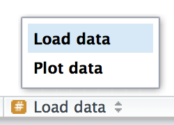

# 工作流程：代码风格

编写良好的代码风格就像正确的标点符号一样重要：你可以不用，但它确实让事情变得更易读。即使作为一个非常新的程序员，也要注重自己的代码风格。使用一致的风格使得他人（包括未来的自己！）更容易阅读你的工作，如果需要从他人那里获取帮助，这一点尤为重要。本章将介绍本书中使用的 tidyverse 风格指南的最重要要点。

一开始，对代码进行格式化可能会感觉有点繁琐，但如果你不断练习，它将很快成为你的第二天性。此外，还有一些很棒的工具可以快速调整现有的代码格式，比如 Lorenz Walthert 开发的 styler 包。安装了 styler 包（install.packages("styler")）之后，可以通过 RStudio 的命令面板轻松使用它。命令面板允许你使用任何内置的 RStudio 命令以及许多由包提供的插件。按下 Cmd/Ctrl + Shift + P 打开面板，然后输入“styler”以查看 styler 提供的所有快捷键。[图一](#fig1) 展示了结果。

<figure id="fig1">
  
  <figcaption>图一：RStudio 的命令面板使得通过键盘轻松访问每个 RStudio 命令成为可能。</figcaption>
</figure>

我们将在本章的代码示例中使用 tidyverse 和 nycflights13 包。

```r
library(tidyverse)
library(nycflights13)
```

## 变量命名

我们在第2.3节中简要讨论了变量命名。记住，变量名（通过 <- 创建的变量和通过 mutate() 创建的变量）应该仅使用小写字母、数字和下划线。使用下划线来分隔名称中的单词。

```R
# 建议使用：
short_flights <- flights |> filter(air_time < 60)

# 避免使用：
SHORTFLIGHTS <- flights |> filter(air_time < 60)
```

作为一个一般性的经验法则，最好偏向于使用长的、描述性的名称，这样更容易理解，而不是简洁的名称，虽然打字速度快，但难以理解。在编写代码时，使用短名称相对节省的时间很少（特别是由于自动完成将帮助你完成输入），但当你回到旧代码时，被迫去解析一个晦涩的缩写会很耗时。

如果你有一堆相关的名称，尽量保持一致。当你忘记先前的约定时，不一致很容易出现，所以如果你不得不回去重新命名东西，也不要感到难过。总的来说，如果你有一堆变量是一个主题的变体，最好给它们一个共同的前缀，而不是一个共同的后缀，因为自动完成最适合于变量的开头部分。

## 空格

在数学运算符的两侧放置空格，除了 ^（即 +、-、==、< 等），以及赋值运算符 <-。

```r
# 建议使用
z <- (a + b)^2 / d

# 避免使用
z<-( a + b ) ^ 2/d
```

对于常规函数调用的括号内外不要放置空格。在逗号后面总是要加一个空格，就像标准英语一样。

```r
# 建议使用
mean(x, na.rm = TRUE)

# 避免使用
mean (x ,na.rm=TRUE)
```

如果添加额外的空格可以提高对齐度，则可以添加额外的空格。例如，如果你在 mutate() 中创建多个变量，你可能希望添加空格以使所有 = 对齐。这样可以更轻松地浏览代码。

```r
flights |> 
  mutate(
    speed      = distance / air_time,
    dep_hour   = dep_time %/% 100,
    dep_minute = dep_time %%  100
  )
```

## 管道操作

|> 应该在其前后都有一个空格，并且通常应该是一行中的最后一个元素。这样可以更容易地添加新的步骤、重新排列现有的步骤、修改步骤中的元素，并通过浏览左侧的动词来获得 10,000 英尺的视角。

```r
# 建议使用
flights |>  
  filter(!is.na(arr_delay), !is.na(tailnum)) |> 
  count(dest)

# 避免使用
flights|>filter(!is.na(arr_delay), !is.na(tailnum))|>count(dest)
```

如果你要将管道传递到的函数具有命名参数（例如 mutate() 或 summarize()），请将每个参数放在新行上。如果函数没有命名参数（例如 select() 或 filter()），则保持所有内容在一行上，除非无法容纳，此时应将每个参数放在自己的行上。

```r
# 建议使用
flights |>  
  group_by(tailnum) |> 
  summarize(
    delay = mean(arr_delay, na.rm = TRUE),
    n = n()
  )

# 避免使用
flights |>
  group_by(
    tailnum
  ) |> 
  summarize(delay = mean(arr_delay, na.rm = TRUE), n = n())
```

在管道的第一步之后，每一行都应该缩进两个空格。RStudio 会在 |> 后的换行符后自动为你添加空格。如果你将每个参数放在自己的行上，请额外缩进两个空格。确保 ) 单独一行，且不缩进，以匹配函数名的水平位置。

```r
# 建议使用
flights |>  
  group_by(tailnum) |> 
  summarize(
    delay = mean(arr_delay, na.rm = TRUE),
    n = n()
  )

# 避免使用
flights|>
  group_by(tailnum) |> 
  summarize(
             delay = mean(arr_delay, na.rm = TRUE), 
             n = n()
           )

# 避免使用
flights|>
  group_by(tailnum) |> 
  summarize(
  delay = mean(arr_delay, na.rm = TRUE), 
  n = n()
  )
```

如果管道可以轻松地放在一行上，则可以违背其中一些规则。但是根据我们的集体经验，短片段通常会变长，因此你通常可以通过从一开始就获得所需的所有垂直空间来节省时间。

```r
# 这可以紧凑地放在一行上
df |> mutate(y = x + 1)

# 虽然这占据了4倍的行数，但容易扩展到更多变量和更多步骤
df |> 
  mutate(
    y = x + 1
  )
```

最后，要注意避免编写非常长的管道，例如超过 10-15 行。尽量将其拆分成较小的子任务，并为每个任务命名一个信息丰富的名称。这些名称将有助于提示读者正在发生什么，并使检查中间结果是否符合预期变得更容易。每当你可以为某些东西提供信息丰富的名称时，都应该为其提供信息丰富的名称，例如在更改数据结构后，例如在数据透视或汇总之后。不要指望一次就做对！这意味着如果中间状态可以得到良好的名称，就要拆分长的管道。

## ggplot2

对 ggplot2 使用相同的基本规则，只需将 + 看作与 |> 相同。

```r
flights |> 
  group_by(month) |> 
  summarize(
    delay = mean(arr_delay, na.rm = TRUE)
  ) |> 
  ggplot(aes(x = month, y = delay)) +
  geom_point() + 
  geom_line()
```

同样，如果无法将函数的所有参数放在一行上，请将每个参数放在自己的行上：

```r
flights |> 
  group_by(dest) |> 
  summarize(
    distance = mean(distance),
    speed = mean(distance / air_time, na.rm = TRUE)
  ) |> 
  ggplot(aes(x = distance, y = speed)) +
  geom_smooth(
    method = "loess",
    span = 0.5,
    se = FALSE, 
    color = "white", 
    linewidth = 4
  ) +
  geom_point()
```

注意从 |> 到 + 的过渡。我们希望不需要这种过渡，但不幸的是，ggplot2 是在发现管道之前编写的。

## 分段注释

随着脚本变得越来越长，你可以使用分段注释将文件分解为易于管理的部分：

```r
# 加载数据 --------------------------------------

# 绘制数据 --------------------------------------
```

RStudio 提供了一个键盘快捷键来创建这些标题（Cmd/Ctrl + Shift + R），并将它们显示在编辑器左下角的代码导航下拉菜单中，如[图二](#fig2)所示。

<figure id="fig2">
  
  <figcaption>图二：在脚本中添加分段注释后，你可以使用脚本编辑器左下角的代码导航工具轻松导航到它们。</figcaption>
</figure>

## 练习

根据上述指南，重新设计以下管道：

```R
flights|>filter(dest=="IAH")|>group_by(year,month,day)|>summarize(n=n(),
delay=mean(arr_delay,na.rm=TRUE))|>filter(n>10)

flights|>filter(carrier=="UA",dest%in%c("IAH","HOU"),sched_dep_time>
0900,sched_arr_time<2000)|>group_by(flight)|>summarize(delay=mean(
arr_delay,na.rm=TRUE),cancelled=sum(is.na(arr_delay)),n=n())|>filter(n>10)
```

## 总结

在本章中，你学到了代码风格的最重要原则。这些可能一开始会感觉像一组任意的规则（因为它们确实是！），但随着时间的推移，随着你编写更多的代码并与更多人分享代码，你会意识到保持一致的风格是多么重要。不要忘记 styler 包：它是快速改进风格不佳代码质量的好方法。

在下一章中，我们将回到数据科学工具，学习有关整洁数据的知识。整洁数据是一种一致的组织数据框的方式，它在整个 tidyverse 中都被使用。这种一致性使你的生活变得更加轻松，因为一旦你有了整洁的数据，它就能与绝大多数 tidyverse 函数一起正常工作。当然，生活从来都不容易，在现实世界中，你遇到的大多数数据集都不会是整洁的。因此，我们还将教你如何使用 tidyr 包整理你的非整洁数据。