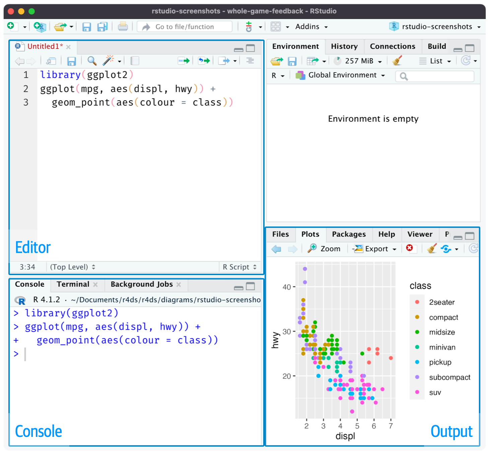

# Workflow: scripts and projects

本章将介绍两个组织代码的基本工具：脚本和项目。

## 脚本

到目前为止，您已经使用控制台来运行代码。这是一个很好的起点，但随着您创建了更复杂的 ggplot2 图形和更长的 dplyr 流水线，您会发现控制台很快就会变得拥挤起来。为了给自己更多的工作空间，请使用脚本编辑器。通过单击“文件”菜单，选择“新建文件”，然后选择“R 脚本”，或使用键盘快捷键 Cmd/Ctrl + Shift + N 打开它。现在您将看到四个窗格，如[图一](#fig1)所示。脚本编辑器是实验代码的好地方。当您想要更改某些内容时，您不必重新键入整个代码，您只需编辑脚本并重新运行它。一旦您编写了有效且符合您要求的代码，您可以将其保存为脚本文件，以便以后轻松返回。

<figure id="fig1">
  
  <figcaption>图一：打开脚本编辑器会在 IDE 的左上方添加一个新的窗格。</figcaption>
</figure>

### 运行代码

脚本编辑器是构建复杂 ggplot2 图或长序列 dplyr 操作的绝佳地方。有效使用脚本编辑器的关键是记住其中最重要的键盘快捷键之一：Cmd/Ctrl + Enter。这会在控制台中执行当前的 R 表达式。例如，看下面的代码：

```R
library(dplyr)
library(nycflights13)

not_cancelled <- flights |> 
  filter(!is.na(dep_delay)█, !is.na(arr_delay))

not_cancelled |> 
  group_by(year, month, day) |> 
  summarize(mean = mean(dep_delay))
```

如果你的光标在 █ 处，按下 Cmd/Ctrl + Enter 将运行生成 not_cancelled 的完整命令。它还会将光标移动到以下语句（以 not_cancelled |> 开头）。这样可以轻松地通过反复按下 Cmd/Ctrl + Enter 逐步执行你的完整脚本。

你也可以通过按下 Cmd/Ctrl + Shift + S 一次性执行完整脚本，而不是逐个表达式地运行代码。定期这样做是确保你已经在脚本中捕捉到所有重要部分的好方法。

我们建议你始终从需要的包开始编写你的脚本。这样，如果你与他人分享你的代码，他们可以轻松看到需要安装哪些包。但请注意，永远不要在分享的脚本中包含 install.packages()。如果他们不小心的话，将更改他们的计算机是不礼貌的！

在未来的章节中工作时，我们强烈建议你从脚本编辑器开始，并练习你的键盘快捷键。随着时间的推移，通过这种方式将代码发送到控制台将变得如此自然，以至于你甚至不会想到它。

### RStudio 排错

在脚本编辑器中，RStudio 会用红色波浪线和侧边栏中的红色叉号突出显示语法错误：

<figure id="fig2">
  
</figure>

将光标悬停在叉号上，查看问题所在：

<figure id="fig3">
  
</figure>

RStudio还会告诉你可能存在的问题：

<figure id="fig4">
  
</figure>

### 保存与命名

RStudio 在你退出时会自动保存脚本编辑器的内容，并在重新打开时自动重新加载。尽管如此，最好还是避免使用Untitled1、Untitled2、Untitled3等命名，而是保存你的脚本并给它们起一个有意义的名字。

也许你会想把文件命名为 code.R 或者 myscript.R ，但在选择文件名之前，你应该考虑一下。文件命名的三个重要原则如下：

1. 文件名应该是机器可读的：避免使用空格、符号和特殊字符。不要依赖大小写来区分文件。
2. 文件名应该是人类可读的：使用文件名来描述文件的内容。
3. 文件名应该与默认排序相匹配：以数字开头，这样按字母顺序排序时可以按照它们的使用顺序排列。

例如，假设你在项目文件夹中有以下文件。

```plain
alternative model.R
code for exploratory analysis.r
finalreport.qmd
FinalReport.qmd
fig 1.png
Figure_02.png
model_first_try.R
run-first.r
temp.txt
```

这里有各种问题：很难找到应该先运行哪个文件，文件名包含空格，有两个具有相同名称但大小写不同的文件（finalreport和FinalReport1），有些文件名不能描述其内容（run-first和temp）。

以下是以更好的方式命名和组织相同的文件集：

```plain
01-load-data.R
02-exploratory-analysis.R
03-model-approach-1.R
04-model-approach-2.R
fig-01.png
fig-02.png
report-2022-03-20.qmd
report-2022-04-02.qmd
report-draft-notes.txt
```

对关键脚本进行编号使得以正确的顺序运行它们变得很明显，而一致的命名方案使得看到变化变得更容易。此外，图像被以相似的方式标记，报告通过包含在文件名中的日期进行区分，而temp被重命名为report-draft-notes以更好地描述其内容。如果一个目录中有很多文件，可以进一步组织，将不同类型的文件（脚本、图像等）放在不同的目录中是一个好的建议。

